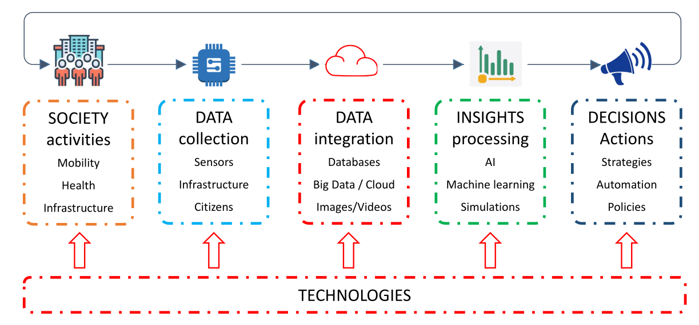
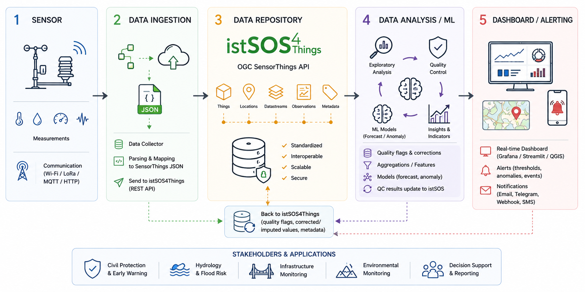

# Society 5.0

Society 5.0 is a vision for a future society that integrates advanced technologies, such as the Internet of Things (IoT), artificial intelligence (AI), and big data, to create a more sustainable, inclusive, and **human-centered society**. In this context, smart monitoring systems play a crucial role in enhancing situational awareness, supporting decision-making, and enabling early warning systems for various applications, including environmental monitoring, infrastructure management, and disaster risk reduction.

## Conceptual data flow (from sensor to decision)

Sensors are used to traslate physical phenomena into digital data. Digital data representing the physical world are the basis for enhancing situational awareness, supporting decision-making and enabling early warning systems. We do not have to forget that the digital representation of the real world, the so callked **digital twin**, make sense only if permits to extract useful insights and actionable information. 

## Data Management
The data management process for smart monitoring systems typically involves several stages, including in-situ data collection trough sensors, data communication and integration, data storing and serving, data analitichs and quality controls, reporting and alarming. Each stage is crucial to ensure that the data is reliable, accurate and useful for decision-making.

### Quality control (QC)
The quality of the data collected by sensors is critical for the reliability and usefulness of the digital twin.
Unfortunately, sensors may drift over time, communication failures may create missing observations, electronic noise may generate unrealistic values, and extreme environmental conditions may produce signals that are difficult to distinguish from sensor errors. DUe to these issues, raw sensor data cannot automatically be considered reliable and must be subjected to **quality control (QC) procedures** that opportunately detect and handle these issues either by correcting data or flagging it for further consideration (e.g. using different weigths based on data quality).

Most commonly data are exposed to a sequential QC pipeline where each test or operation evaluates observations and updates their quality flags (aka *quality annotations*), which can later guide filtering, correction, interpolation or alerting.

The objective of quality control is not simply to remove “bad data”, but rather to evaluate the reliability of each observation, identify suspicious measurements, document uncertainties and preserve traceability throughout the analysis proces which can later guide filtering, correction, interpolation or alerting.

A QC workflow is typically implemented as a sequence of checks applied to the dataset. Each observation is evaluated independently or in relation to neighbouring observations. Instead of directly modifying the data, the system usually assigns a quality state or a flag to each measurement (aka *quality annotations*). Conceptually, each observation therefore becomes associated not only with a value, but also with information describing its reliability.

| Timestamp | Value | Quality State |
|---|---:|---|
| 10:00 | 15.2 | valid |
| 11:00 | 999 | invalid |
| 12:00 | NaN | missing |
| 13:00 | 14.8 | suspicious |

Different types of quality checks can be applied depending on the problem being investigated. Missing-data checks identify gaps caused by communication failures or power interruptions. Range checks verify whether observations remain within physically plausible limits. Outlier detection methods identify values that strongly differ from the expected behaviour of the signal. Temporal consistency checks analyse whether changes between consecutive observations are realistic. Drift analysis evaluates whether a sensor progressively deviates from its expected behaviour over time.

> a monitoring pipeline must distinguish between **data quality problems** and **real hazardous events**.

An important aspect of quality control is distinguishing between actual data problems and real hazardous events. Some anomalous observations may indeed correspond to sensor malfunctions, while others may represent real environmental phenomena such as floods, landslides or extreme rainfall. For this reason, quality control should not blindly remove all anomalous observations. Instead, the workflow should support interpretation, traceability and informed decision-making.

Quality control is also essential for machine learning and forecasting applications. Predictive models are highly sensitive to data quality, and erroneous observations may significantly reduce model accuracy or generate false alarms. A robust QC pipeline therefore becomes a fundamental step before performing forecasting, anomaly detection or advanced analytics.

Modern monitoring systems should preserve raw observations, quality annotations and corrected datasets separately. This ensures reproducibility, transparency and scientific traceability, allowing future users to understand how data were processed and validated throughout the workflow.

---

The following sections provide an overview of common data quality checks for smart monitoring systems, including sensor drift, missing data, faulty sensor values and extreme events. For each issue, we will discuss typical examples, visual and statistical checks, machine learning options and possible correction strategies.

---

## Sensor Drift

Sensor drift is a progressive deviation of the measured value from the true value. It can be caused by ageing, loss of calibration, fouling, temperature effects or electronic degradation.

Typical examples:

- a water level sensor slowly overestimates river stage;
- a temperature sensor gradually shifts upward;
- a deformation sensor accumulates bias unrelated to real displacement.

Visual checks:

- plot the full time series;
- add a rolling mean;
- compare with a reference station if available;
- inspect residuals after removing expected seasonality.

Statistical checks:

- rolling mean and rolling standard deviation;
- linear trend estimation;
- residual analysis;
- comparison with a stable baseline period.

ML options:

- regression model trained on a clean baseline period;
- residual monitoring;
- change point detection;
- autoencoder reconstruction error.

Possible correction:

- detrending;
- recalibration using a reference sensor;
- flagging data after the estimated drift onset;
- preserving both raw and corrected values.

---

## Missing Data

Missing data occur when expected observations are absent. This is common in wireless sensor networks because of power issues, communication failures, packet loss or maintenance interruptions.

Visual checks:

- time-series plot with gaps;
- missing-value heatmap;
- expected versus actual timestamp frequency.

Statistical checks:

- `isna()` counts;
- time difference between consecutive observations;
- detection of gaps longer than the expected sampling interval.

ML options:

- regression-based imputation;
- Kalman filtering;
- Gaussian process interpolation;
- forecasting-based imputation.

Possible correction:

- linear interpolation for short gaps;
- spline interpolation for smooth signals;
- model-based reconstruction for longer gaps;
- no correction when the gap is too long or during critical periods.

---

## Faulty Sensor Values and Outliers

Faulty values are measurements that are physically impossible or implausible because of malfunction, electronic noise, frozen readings, incorrect unit conversion or transmission errors.

Outliers are observations that deviate strongly from the rest of the dataset. They may be errors or real rare events.

Visual checks:

- time-series plot;
- histogram;
- boxplot;
- rolling median comparison.

Statistical checks:

- physical min/max thresholds;
- z-score;
- modified z-score based on median absolute deviation;
- interquartile range;
- rolling median residuals.

ML options:

- Isolation Forest;
- Local Outlier Factor;
- One-Class SVM;
- autoencoders.

Possible correction:

- replace faulty values with `NaN`;
- interpolate removed values only if gaps are short;
- apply median filtering;
- preserve a quality flag.

Important: not all outliers are errors. In risk monitoring, some outliers may represent real hazardous events.

---

## Extreme Events

Extreme events are rare but real observations associated with hazards. They must not be removed as noise.

Typical examples:

- extreme rainfall;
- flood peak;
- rapid slope displacement;
- abnormal bridge vibration during an earthquake or heavy traffic;
- heat wave.

Visual checks:

- time-series plot with alert thresholds;
- rolling accumulation;
- event-window zoom;
- exceedance plot.

Statistical checks:

- fixed thresholds;
- percentiles such as 95th or 99th percentile;
- return-period thresholds;
- rolling accumulation;
- rate of change;
- duration above threshold.

ML options:

- anomaly detection;
- classification of alert levels;
- forecasting future threshold exceedance;
- sequence models.

Treatment:

- do not correct the event;
- flag it as hazardous;
- compute event statistics;
- use it for alerting and forecasting.

---

## Recommended Workflow

For each dataset:

1. Load the dataset.
2. Parse timestamps.
3. Plot the raw time series.
4. Identify the suspected issue.
5. Apply at least one visual detection method.
6. Apply at least one statistical or ML-based method.
7. Decide whether the issue should be corrected, removed, flagged or preserved.
8. Produce a cleaned or enriched dataset.
9. Document all assumptions.
10. Propose an alerting or monitoring rule.

> **Good practice**: always preserve raw data, cleaned data, quality flags, correction method and processing code.
