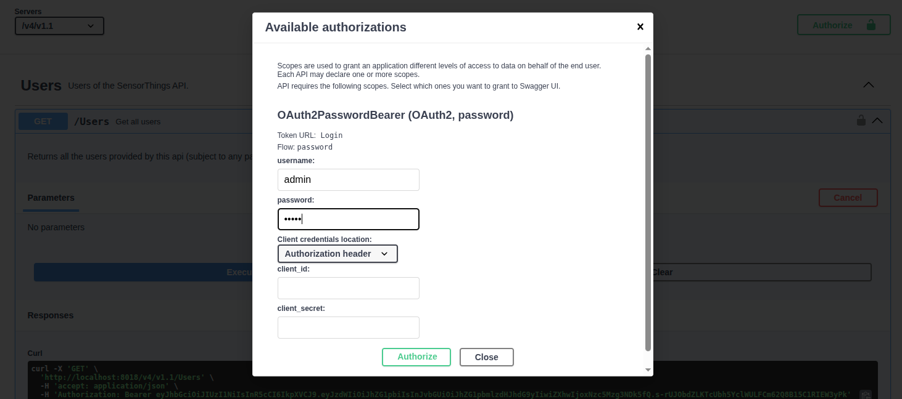

# Managing Authentication and Authorization in istSOS4

OAuth 2.0 (Open Authorization) is an authorization framework that allows third-party applications to grant access to a user's resources without sharing their credentials. It is widely used for secure delegated access to resources across web applications and APIs.

In the context of istSOS4, OAuth 2.0 can be implemented to manage authentication and authorization for users accessing the SensorThings API. This allows for secure access control, enabling users to authenticate using their credentials and granting permissions based on their roles.

In simple terms:

- **Authentication** answers the question: *who are you?*  
  This happens when a user logs in and receives an access token.
- **Authorization** answers the question: *what are you allowed to do?*  
  This is controlled through roles and policies.

A **role** describes the type of user, application, or device.  
A **policy** gives that role the actual permissions to access or manage data.

> Creating a user is not enough by itself.  
> The user also needs a policy, otherwise the system does not know what that user is allowed to do.

## Roles and permissions in istSOS4

The table below summarizes the main roles used in istSOS4.

| Role | Who or what uses it | What it can do | Typical use |
|---|---|---|---|
| `admin` | System administrator | Has full access to the system. The administrator can manage data and resources, and is also the only role that can create users and policies. | Full system management, initial setup, access management, user management |
| `viewer` | People or applications that only need to consult data | Reads data, but cannot create, change, or delete it. | Dashboards, public applications, reporting tools |
| `editor` | Authorized users or services that manage system resources | Reads, creates, updates, and deletes data according to the assigned policy. | System configuration, maintenance, data management |
| `sensor` | Devices, sensors, data loggers, or automatic ingestion services | Sends new observations and can update some operational information, such as location or datastream information. | IoT devices, automatic data collection, data ingestion |
| `obs_manager` | Users or services responsible for observation management | Manages observations more extensively, including correcting or deleting existing observations when needed. | Data validation, quality control, correction of wrong observations |

## Setting istSOS4 Users
In istSOS4, you can manage users and their roles to control access to the SensorThings API. Users can be assigned different roles, such as `admin`, `editor`, or `viewer`, each with specific permissions that determine what actions they can perform on the API. For example, an `admin` user may have full access to all API endpoints, while a `viewer` user may only have read access to certain endpoints.
By configuring user roles and permissions, you can ensure that only authorized users can access sensitive data or perform critical operations on the SensorThings API, enhancing the security of your istSOS4 implementation.

To create users you need to login as an admin user and then you can create new users with specific roles. You can also manage existing users, such as updating their information or changing their roles as needed. This allows you to maintain control over who has access to your SensorThings API and what actions they can perform.

