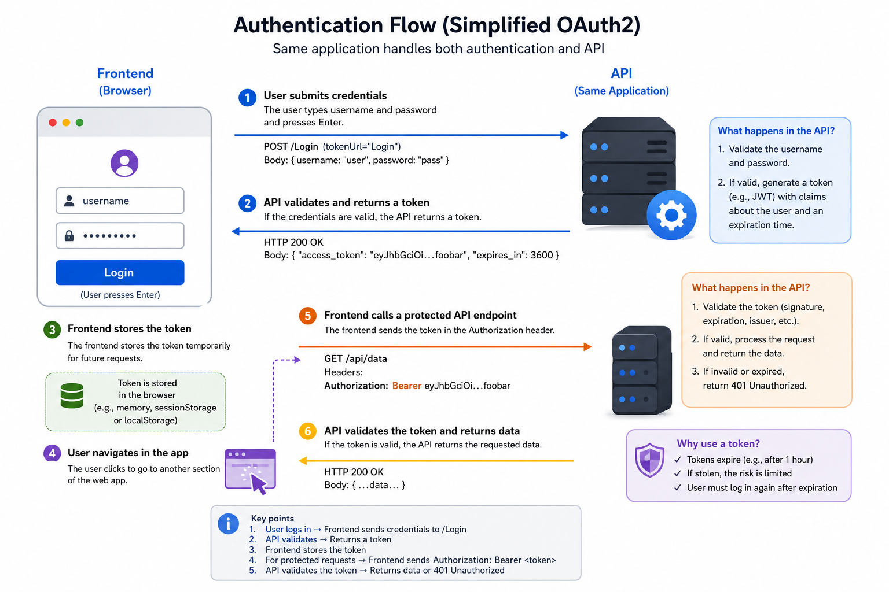

# Managing Authentication & Authorization

OAuth 2.0 (Open Authorization) is an authorization framework that allows third-party applications to grant access to a user's resources without sharing their credentials. It is widely used for secure delegated access to resources across web applications and APIs.
In the context of our istSOS4 SensorThingsAPI implementation, we have implemented the OAuth 2.0 "password" flow to manage user authentication and authorization. This allows users to securely access the API by providing their credentials and obtaining a token that can be used for subsequent requests.

## OpenAPI and Authorization
OpenAPI is a specification for building APIs that includes support for defining security schemes and requirements. In our implementation, we have defined an OAuth2 security scheme in the OpenAPI documentation, which allows us to specify the authentication mechanism for our API endpoints.

Navigate to the interactive documentation at: `/docs` <https://localhost:8018/istsos4/v1.1/docs> or <https://istsos.org/v4/v1.1/docs> and check the top-right corner of the page.

You will see something like this:


!!! Authorize button
    You already have a shiny new "Authorize" button.<br>
    And your path operation has a little lock in the top-right corner that you can click.


And if you click it, you have a little authorization form to type a <code>username</code> and <code>password</code> (and other optional fields):


## The password flow

The password "flow" is one of the ways ("flows") defined in OAuth2, to handle security and authentication.

OAuth2 was designed so that the backend or API could be independent of the server that authenticates the user.

But in this case, the same application will handle the API and the authentication.

So, let's review it from that simplified point of view:

1. The user types the <code>username</code> and <code>password</code> in the frontend, and hits <code>Enter</code>.
2. The frontend (running in the user's browser) sends that <code>username</code> and <code>password</code> to a specific URL in our API (declared with <code>tokenUrl="Login"</code>).
3. The API checks that <code>username</code> and <code>password</code>, and responds with a "token"
    - A "token" is just a string with some content that we can use later to verify this user.
    - Normally, a token is set to expire after some time.
        - So, the user will have to log in again at some point later.
        - And if the token is stolen, the risk is less. It is not like a permanent key that will work forever (in most of the cases).
4. The frontend stores that token temporarily somewhere.
5. The user clicks in the frontend to go to another section of the frontend web app.
6. The frontend needs to fetch some more data from the API.
    - But it needs authentication for that specific endpoint.
    - So, to authenticate with our API, it sends a header <code>Authorization</code> with a value of <code>Bearer</code> plus the token.  
    Foe example: if the token contains foobar, the content of the <code>Authorization</code> header would be: <code>Bearer foobar</code>.



## SensorThings Roles and Permissions
In istSOS4 users have specific roles which define their access permissions.  
Permissions are managed trough database privileges to access specific entity of the Sensorthings schema.  
Therefore each role has a set of privileges that define the level of access granted to specific entity in the system.  
The following table outlines the different defined roles and their corresponding permissions.  


| Role          | Description                                          | Entity Permissions                                                                                                                                                                            |
| ------------- | ---------------------------------------------------- | :------------------------------------------------------------------------------------------------------------------------------------------------------------------------------------------- |
| `admin`       | Have all the privileges                              | All `PRIVILEGES` on all entity of sensorthings schema                                                                                                                                        |
| `viewer`      | Only view capabilities                               | `SELECT` privilege on all entity                                                                                                                                                             |
| `editor`      | Can do everything except defining users            | `SELECT` privilege on all entity<br>`INSERT`, `UPDATE`, `DELETE` privileges on all entity (except User element)                                                                                |
| `obs_manager` | Can view everything and manage observations          | `SELECT` privilege on all entity<br>`INSERT`, `UPDATE`, `DELETE` privileges on Observation element<br>`INSERT` privilege on FeaturesOfInterest element<br>`UPDATE` privilege on Datastream element |
| `sensor`      | Can view everything and only insert new observations | `SELECT` privilege on all entity<br>`INSERT` privilege on Observation and FeaturesOfInterest elements<br>`UPDATE` privilege on Datastream element                                                |

## Creating Users and Assigning Roles
To create users and assign roles in istSOS4, you can use the swagger interface to access the API provided by the system. This interface allows you to manage users, assign them specific roles, and control their access permissions.

### :lucide-play: Login as admin
To create new users, you need to log in as an admin user. The admin user has full access to the system and can manage users and their roles. By default, the admin user is created with the following credentials:

- **username**: admin
- **password**: admin

After authenticating in the system, you will see it like:


### :lucide-play: Create a viewer and an editor
Once you are logged in as an admin, you can create new users and assign them specific roles. 

To create a new user, you can send a POST request to the `/users` endpoint with the following JSON body:

```json
  {
    "username": "name_of_user",
    "password": "password_of_user",
    "uri": "https://orcid.org/0000-0004-3456-7890",
    "role": "role_of_user"
  }
```

Using the swagger interface, you can create:

- a user with the username "editor1/editor1" and assign them the "editor" role, which allows them to manage data but not create new users.
- a user with the username "viewer1/viewer1" and assign them the "viewer" role, which allows them to only view data without making any changes.


### :lucide-play: Test the authorization
Now that you have created new users with specific roles, you can test the authorization by logging in with those users and trying to perform actions that are restricted based on their roles.

Now logout from the admin account, login as a Viewer and try to create a Thing!

!!! remember
    To create an Element you need to execute a POST request with the appropriate body that represents the element you want to create.


Since you're logged in as a Viewer, you do not have the necessary privileges to create a Thing. You should therefore see the following error message:

```json
{
  "code": 401,
  "type": "error",
  "message": "Insufficient privileges."
}
```

