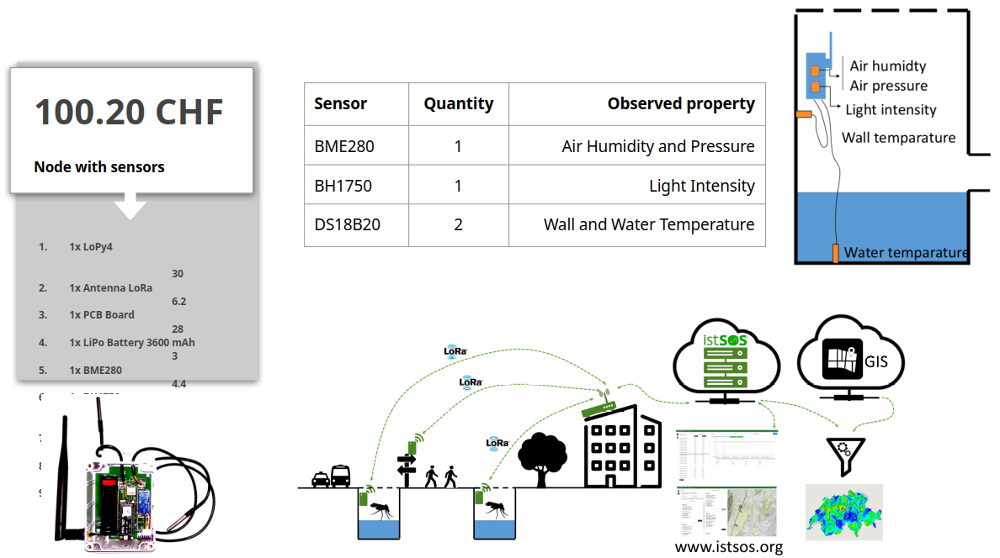
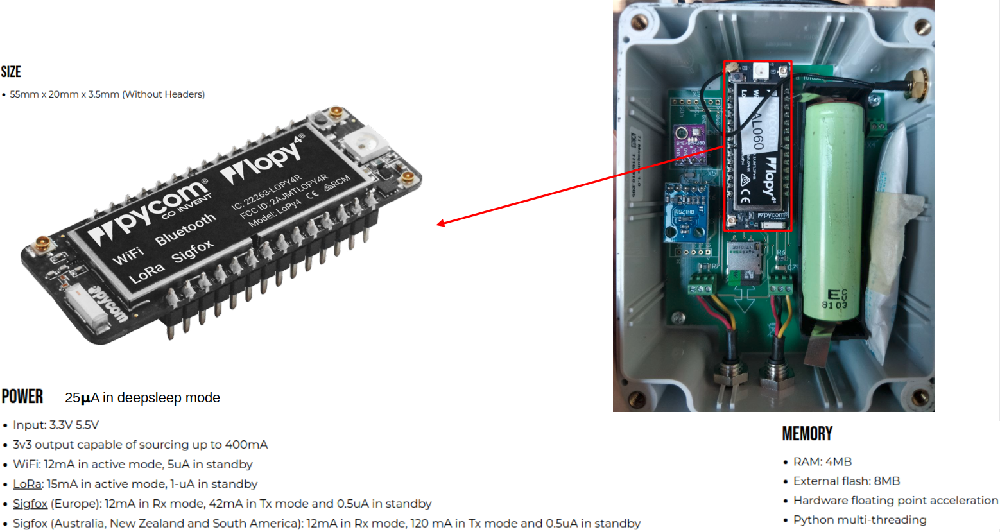
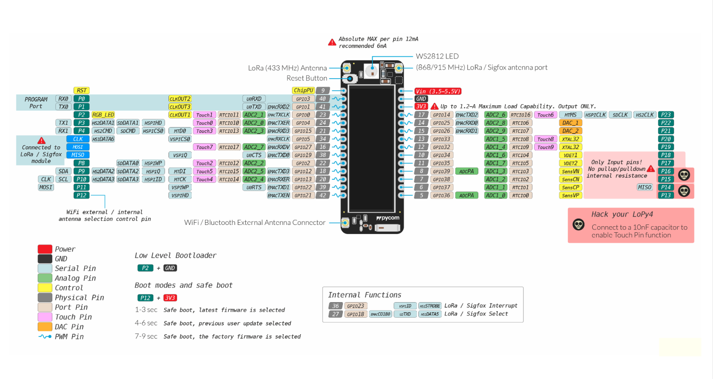
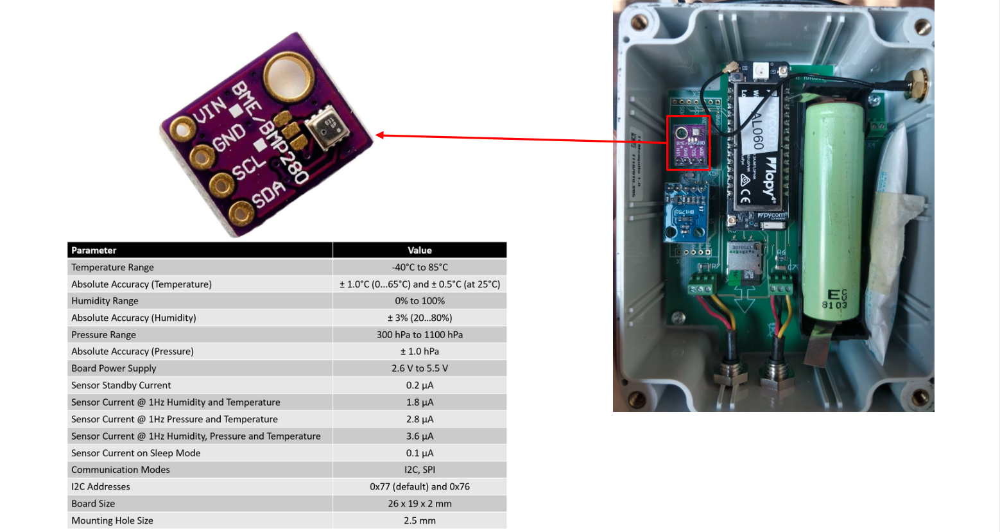
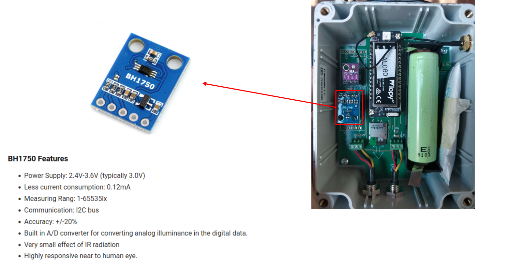
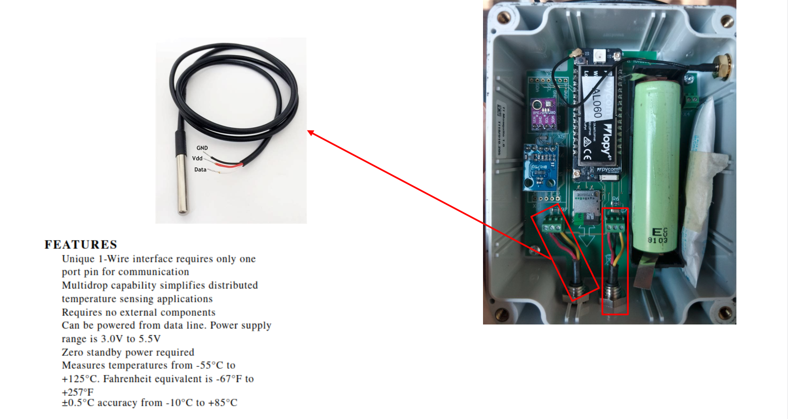
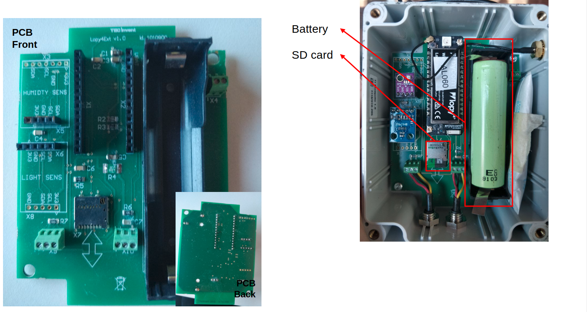

# Load data from sensors
In order to upload observations from sensors to SensorThingsAPI you have several options dependiong on the sensor type.

| Sensor/data source type   | Example                                      | Best integration approach                                                               |
| ------------------------- | -------------------------------------------- | --------------------------------------------------------------------------------------- |
| Smart programmable sensor | ESP32, Raspberry Pi, custom logger           | Direct POST to SensorThings Observations                                                |
| Simple raw sensor         | Time/value string over HTTP, serial, LoRaWAN | Adapter translates raw payload to Observation                                                          |
| Batch logger              | CSV every 10 minutes with 1-minute values    | File parser + bulk observation import                                                   |
| MQTT device               | IoT device publishing to broker              | MQTT consumer or SensorThings MQTT endpoint                                             |
| External data portal      | Manual download of CSV/XLS                   | Semi-automatic ETL/import pipeline                                                      |
| High-frequency sensor     | Accelerometer, vibration sensor              | Aggregate, chunk, or store files externally; publish summaries/metadata in SensorThings |

In this workshop we will use a simple ESP32-based sensor that directly POSTs observations to SensorThingsAPI.

## The sensor node

The sensor node has been implemented with a project who's aim was to monitor the microclimate of tiger mosquito breeding sites in four swiss cities to forecast mosquito spread. The Project, named [Albis](https://doi.org/10.1038/s41598-022-20436-9), used a custom-built sensor node based on the ESP32 microcontroller, equipped with various environmental sensors (temperature, pressure, humidity, light) to collect data from potential mosquito breeding sites. The collected data was then transmitted to a central server using the SensorThings API for analysis and forecasting.

This sensor node is an IoT device, based on MicroPython and ESP32 hardware, designed to periodically acquire environmental observations and publish them to an istSOS4 / SensorThings API server.

## Mounting the sensors
### The microcontroller 
It support multiple communication channels and is mounted in a waterproof enclosure.

### The Pinout
The sensor node is equipped with the following sensors and their corresponding pin connections.

### Humidity and pressure sensor
The BME280 sensor is used to measure temperature, humidity, and atmospheric pressure.

### Light sensor
The BH1750 sensor is used to measure ambient light intensity.

### Waterproof temperature sensor
The DS18B20 sensor is used to measure temperature and is designed to be waterproof for outdoor applications.

### Battery and SD card
The sensor node is powered by a battery and includes an SD card slot for local data storage.

### Readings and transmission

The sensor node is programmed to periodically (~1 minute) acquire data from the connected sensors, format the measurements according to the SensorThings API model, and transmit them to the server using the configured communication method (WiFi or LoRa).

Microcontrollers at startup execute some initialization code, which includes reading the configuration from `config.json`, setting up the sensors, and establishing communication parameters. Once initialized, the device enters a loop where it performs the following steps:

- authenticates against the SensorThings server, 
- automatically retrieves the `Datastreams` associated with the configured `Thing`, and 
- sends each measurement as a SensorThings `Observation` containing a `phenomenonTime` and a `result` value.

Before transmission, the code performs basic validation and skips invalid measurements. After each acquisition cycle, the device enters deep sleep mode for about 50 seconds to reduce power consumption.

The onboard LED provides visual feedback about the transmission status:

- ⚪ white blink indicates that the observations were successfully transmitted;
- 🟠 an orange blink indicates a transmission or configuration error.

### :lucide-play: Mount your device
Prepare the following components:

- 1 × BME280 environmental sensor
- 1 × BH1750 light sensor
- 1 × LoPy board (matching the case label)
- 1 × PCB with mounted case and probes (matching the LoPy label)

Take a few minutes to get familiar with the different electronic components and their connectors.

Mount all components onto the PCB, carefully checking the correct pin orientation and pinout (refer to the previous sections images if needed).

Finally, connect the WiFi antenna to the LoPy WiFi connector before powering the device.

### :lucide-play: Register sensors in SensorThingsAPI
Before connecting the power to the device you need to register the sensors in the SensorThingsAPI server following the instructions in the [Register Monitoring Stations](ui.md) section.

### :lucide-play: Power on the device and look at the data

- get a battery
- insert the battery paying attention to the polarity
- go to: http://istsos.org/istsos/admin
- Under the “Services” drop down list select “maxdemo” service
- select the “Procedure” to see if data are coming looking at the begin and end position
- if data are coming, click on “Data Management”, then on “Data Viewer”
- select the “service” maxdemo, “offering” temporary and your “procedure” name
- click on “add”
- select a “Property” and click on plot to see data