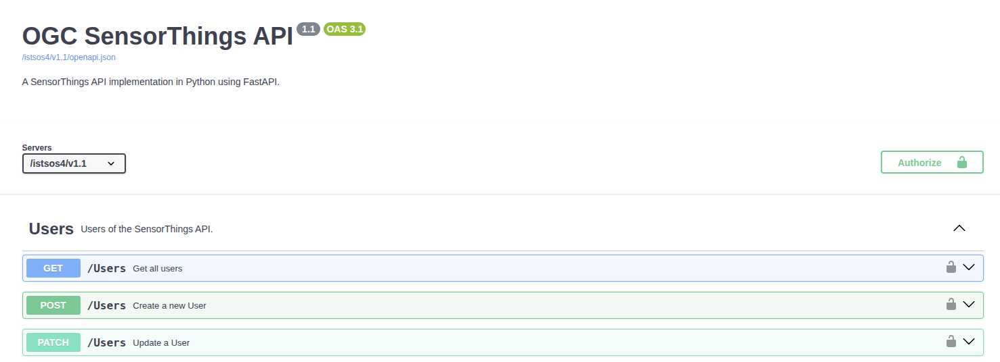
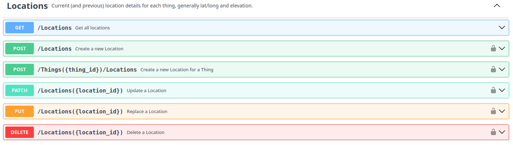
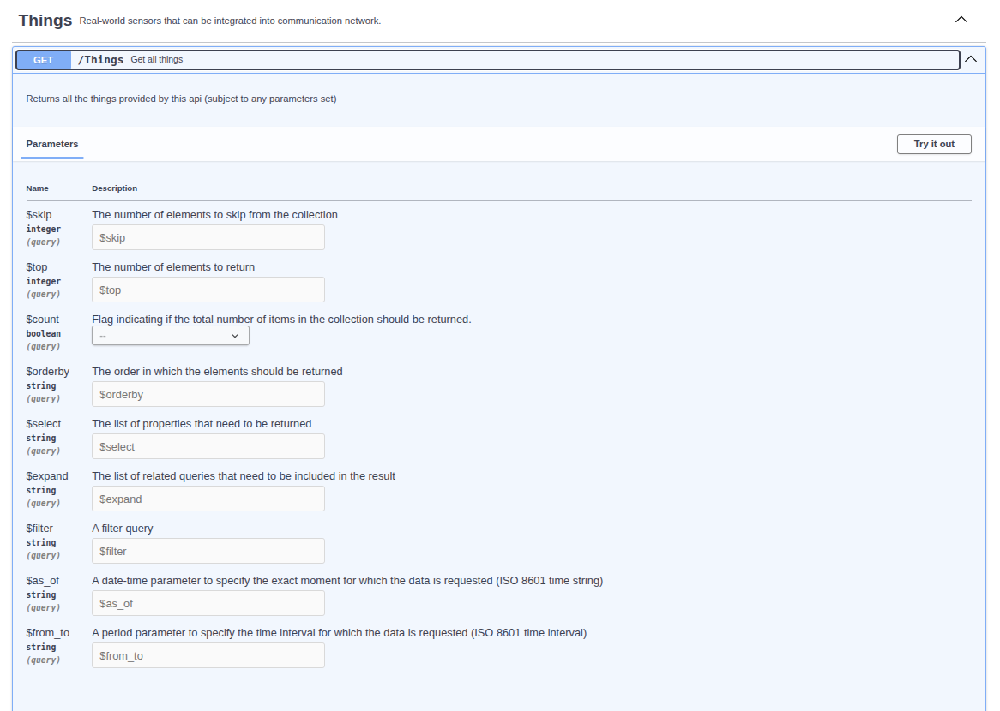
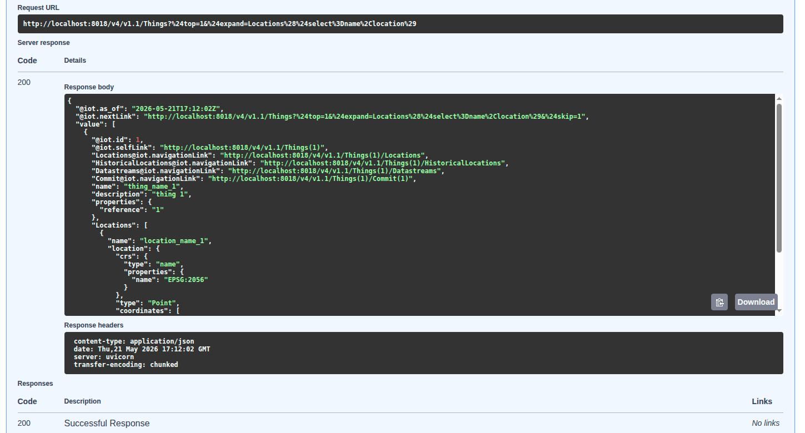

# Exploring the API

In this section, we will explore the API using OpenAPI and Swagger UI. OpenAPI is a specification for building APIs, while Swagger UI is a tool that allows you to visualize and interact with your API's endpoints.

## OpenAPI and Swagger UI
OpenAPI is a specification for building APIs that includes support for defining security schemes and requirements. Swagger UI is a tool that allows you to visualize and interact with your API's endpoints. It provides an interactive interface where you can test your API's functionality and see the responses in real-time.

In our implementation, we have defined an OAuth2 security scheme in the OpenAPI documentation, which allows us to specify the authentication mechanism for our API endpoints.

### :lucide-play: Open the Swagger interface
Open a browser and enter the URL to navigate to the istSOS4 baseurl with the `/docs` location:  
<https://localhost:8018/istsos4/v1.1/docs> or <https://istsos.org/v4/v1.1/docs>  
and check the top-right corner of the page. You should see a "Authorize" button, which indicates that the OAuth2 security scheme is defined and available for use.

Since we have enabled the `anonymous` viewer in our configuration, you can access the API endpoints for `reading` without providing any credentials. This means that most of the `GET` endpoints are visible in the Swagger UI without the "Authorize" button (:lucide-lock-open:) and are accessible without needing to authenticate.

### :lucide-play: Explore the offered Things
In the Swagger UI, you can see a list of available API endpoints. Look for the endpoints related to "Things" and see the available operations.  
You can click the `GET /Things` endpoint to retrieve a list of all Things in the system. Since the anonymous viewer is enabled, you should be able to access this endpoint without providing any credentials just by clicking the `Try it out` button and then `Execute`. 
This will send a request to the API and display the response, which should include a list of Things in the system.

You can try to use the parameters, as defined in the [OData specification](../concepts/sta.md#odata), for example:

- setting `$top=1` to limit the number of results returned.
- setting `$filter=name eq 'thing_name_2'` to filter the results by a specific name. 
- setting `$orderby=name desc` to order the results by name in descending order.
- setting `$select=name,properties/reference` to select only specific properties of the Things.
- setting `$top=1&$expand=Locations` to include related Locations in the response.
- setting `$top=1&$expand=Locations($select=name,location)` to include related Locations in the response with specific properties.

This allow you to see how the API handles query parameters and how it affects the response.

