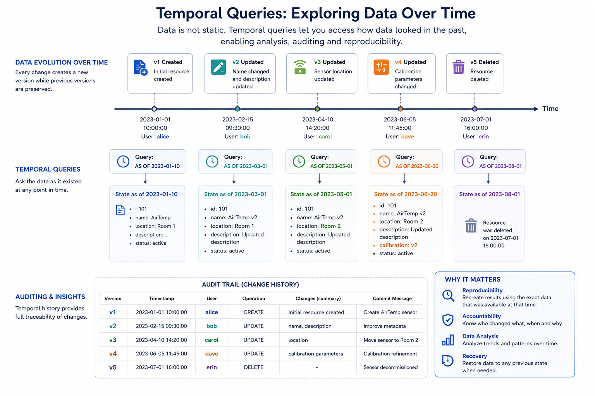
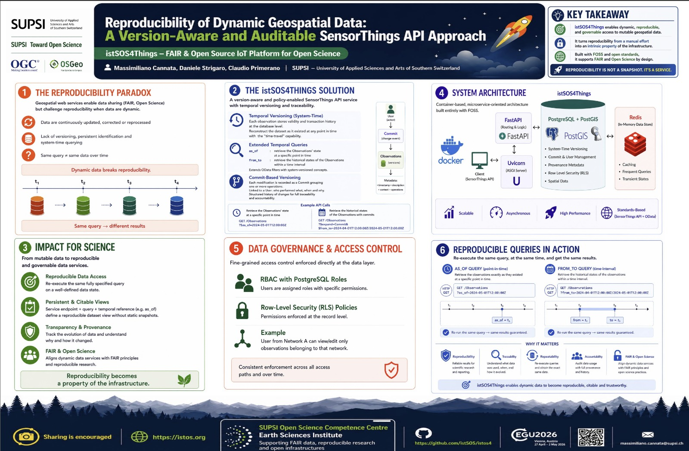
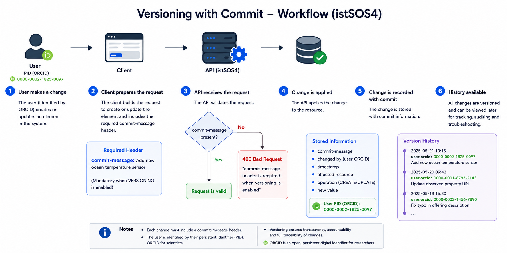
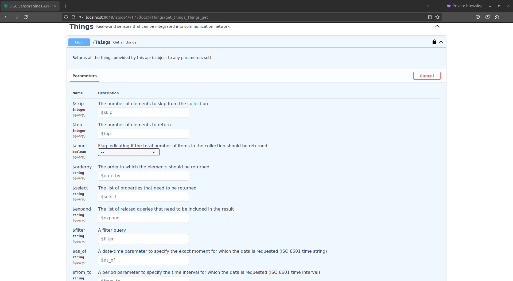

# Traveltime in istSOS4

## Temporal queries

Temporal queries extend the traditional concept of data management by allowing users to access not only the current state of information, but also its past states. In practice, this means that every modification applied to a resource is preserved together with its validity in time, making it possible to reconstruct how the data looked at any specific moment. Rather than overwriting information, the system maintains a continuous history of changes, enabling transparency and reproducibility.

This approach is inspired by the concept of system-versioned tables, introduced in the SQL standard (ISO/IEC 9075-7). The core idea is that data evolves over time and that preserving this evolution is essential for several advanced use cases. These include:

- auditing and accountability, 
- forensic analysis, 
- retrospective data analytics, 
- comparison of historical states, and 
- point-in-time recovery of information.



## Open Science and Reproducibility

Temporal queries play a crucial role not only for data management, but also for the broader principles of Open Science and scientific reproducibility. In many scientific workflows, datasets, metadata, sensor configurations, and processing parameters evolve continuously over time. Without a mechanism to preserve and reconstruct these changes, reproducing past analyses becomes extremely difficult, if not impossible.

In the context of Web services of environmental monitoring data, temporal queries become particularly relevant. Observations, sensor metadata, procedures, or even station configurations may change over time, and understanding when and why those changes occurred is often as important as the data itself. For example, a sensor calibration update, a correction of metadata, or the replacement of an observation procedure can significantly influence the interpretation of historical measurements.

In the age of AI and dynamic data services, temporal queries become essential to ensure transparency, reproducibility, and trust. They allow users and algorithms to retrieve the exact state of data at a specific point in time, preventing ambiguity caused by continuously evolving information sources. In this sense, a temporal query acts similarly to an immutable reference or a DOI for a dataset: instead of pointing only to “the latest version,” it provides access to the precise historical state that was used for an analysis, experiment, or AI model execution. This also reduces the need to continuously create and preserve static snapshots of datasets solely for reproducibility purposes, since the historical state can be reconstructed directly from the service itself.




## Managing Temporal Queries in istSOS4
Implementing temporal queries in SensorThings API and istSOS4 has been addressed by a swissuniversities project named [OSIReS](https://zenodo.org/communities/osires). 
The project has proposed an OGC SensorThings API extension named [Traveltime](traveltime_extension.md) that includes support for temporal queries, 
allowing users to access historical versions of data and metadata. 
This extension is designed to be compatible with the existing SensorThings API specification, while providing additional functionality for managing temporal data. 
By using this extension, users can query the API to retrieve data as it was at a specific point in time, enabling historical analysis and tracking changes over time.

## Versioning and commit messages
Being able to access historical states of data and metadata is a fundamental requirement for temporal queries, but it is not sufficient on its own. To ensure that the history of changes is properly documented and can be traced back, it is essential to implement a versioning system that records every modification made to the data. This is where commit messages come into play. In a versioning system, every time a change is made to the data, it is recorded as a new version, and a commit message is associated with that change. The commit message serves as a descriptive note that explains the nature of the change, the reason behind it, and the author.


In istSOS4, we have the option to enable the `VERSIONING` option in our configuration (this is the case for the defult setting of this workshop).
This means that, once activated, every time you create or update an element in the system this is registered as a change , 


you need to provide a `commit-message` in the header of the request. This is a mandatory requirement to ensure that all changes are properly documented and can be tracked over time. The `commit-message` should provide a brief description of the change being made, which helps in maintaining a clear history of modifications and allows for better collaboration among users. By enforcing the use of commit messages, we can enhance the transparency and **accountability** of changes made to the system, making it easier to understand the context of each change and facilitating troubleshooting and **auditing** processes when needed.



### :lucide-play: Create a Thing
Now login as editor and try again to create a Thing! 
[swagger with docker](http://localhost:8018/v4/v1.1/docs#/Things/create_thing_Things_post)
[swagger with istSOS portal](https://istsos.org/v4/v1.1/docs#/Things/create_thing_Things_post)

Since you're logged in as an Editor, you have the necessary privileges to create a Thing.

You can send a POST request to the `/Things` endpoint with the following JSON body:

```json
{
  "description": "thing 1",
  "name": "thing name 1",
  "properties": {
    "reference": "first"
  }
}
```

At this point you should see and error message indicating that you didn't provide any `commit-message` in the header of the request, which is mandatory to create or update any element in the system since we have enabled the `VERSIONING` option in our configuration.


You should therefore see the following response:

```json
{
  "@iot.id": 2,
  "@iot.selfLink": "http://localhost:8018/istsos4/v1.1/Things(2)",
  "
```


### Retrieve data (Authorization)

To access the data, navigate to the interactive documentation at: <code>/Things</code>.



If you have sufficient privileges to access this entity, you will receive the data, such as:
```json
{
  "@iot.as_of": "2024-12-10T13:36:56Z",
  "value": [
    {
      "@iot.id": 1,
      "@iot.selfLink": "http://localhost:8018/istsos4/v1.1/Things(1)",
      "Locations@iot.navigationLink": "http://localhost:8018/istsos4/v1.1/Things(1)/Locations",
      "HistoricalLocations@iot.navigationLink": "http://localhost:8018/istsos4/v1.1/Things(1)/HistoricalLocations",
      "Datastreams@iot.navigationLink": "http://localhost:8018/istsos4/v1.1/Things(1)/Datastreams",
      "name": "thing name 1",
      "description": "thing 1",
      "properties": {
        "reference": "1"
      },
      "Commit@iot.navigationLink": "http://localhost:8018/istsos4/v1.1/Things(1)/Commit(1)"
    },
  ]
}
```

If you click the lock icon to log out and attempt the same operation again, you will receive an HTTP 401 error with the following response:
```json
{
  "detail": "Not authenticated"
}
```