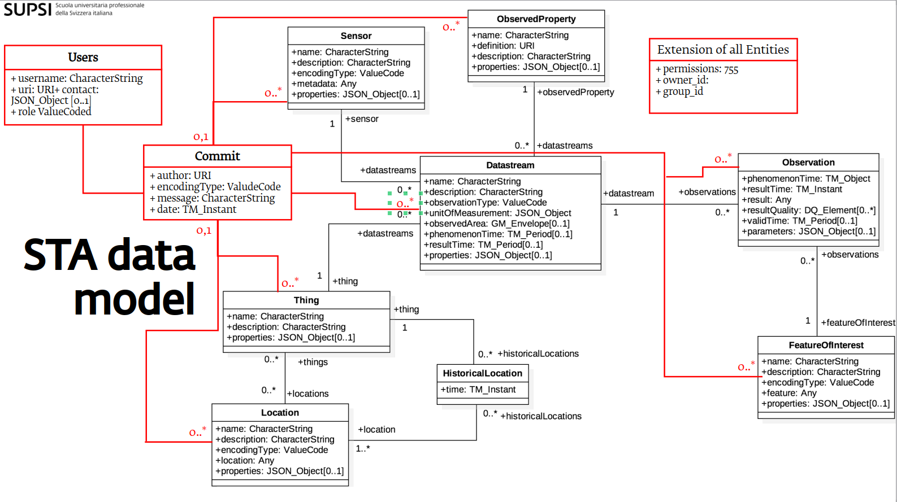

# OGC STA API *Traveltime* Extension

- **Title:** Temporal Data Support
- **Identifier:** traveltime
- **Field Name Prefix:** *Traveltime*
- **Scope:**
- **Extension [Maturity Classification](https://github.com/radiantearth/stac-spec/tree/master/extensions/README.md#extension-maturity):** Pilot
- **Owner**: @massimiliano.cannata

This document explains the "Temporal Queries Support" Extension to the [SensorThings API](https://www.ogc.org/standard/sensorthings/) (STA) specification.

## Overview
This extension assists istSTA users in accessing historical time travel data. It enables users to retrieve information from a web service as it appeared at a specific moment in time, using a new query parameter called **as_of**.

Additionally, it introduces a new entity called Commit, which enables data lineage, allowing users to trace data changes. 
From a scientific perspective, this extension enables FAIR data management by allowing datasets to be permanently cited. This is achieved by using a combination of the service address (<r>in red</r>), the request that returns the dataset (<g>in green</g>), and the dataset's status at a specific time instant (<o>in orange</o>) as a Persistent Identifier for reference.

Example:  
  <r>https://&lt;base_url&gt;/&lt;version&gt;/</r><g>&lt;entity&gt;?$expand=&lt;entity&gt;</g><o>&\$as_of=&lt;date_time&gt;</o>

## Definition

The *Traveltime* extension adds the following optional query parameters to any STA request:

| Parameter | Type               | Description                                                                       |
| --------- | ------------------ | --------------------------------------------------------------------------------- |
| *as_of*   | ISO 8601 date-time | a date-time parameter to specify the exact moment for which the data is requested |
| *from_to* | ISO 8601 period    | a period parameter to specify the time interval for which the data is requested   |

The *Traveltime* extension introduces a new entity, **Commit**, with the following properties:

| Properties     | Type               | Multiplicity and use | Description                                                                    |
| -------------- | ------------------ | -------------------- | ------------------------------------------------------------------------------ |
| *author*       | string(128)        | One (mandatory)      | Authority, Username or User Profile Link                                       |
| *encodingType* | string             | One (optional)       | The encoding type of the message (default is `text`).                          |
| *message*      | string(256)        | One (mandatory)      | Commit message detailing the scope, motivation, and method of the transaction. |
| *date*         | ISO 8601 date-time | One (mandatory)      | A date-time that specifies the exact moment when the commit was executed.      |

Commits are related to SensorThings API entities with a one-to-zero-or-one (1:0..1) relationship.

Additionally, the **User** entity is extended with a navigation link to the Commit entity, allowing users to access the commits associated with their actions.

| Properties | Type | Multiplicity and use | Description |
| ---------- | ---- | -------------------- | ----------- |
| username   | string(128) | One (mandatory) | The username of the user. |
| contact    | json        | One (optional)  | The json that describe the contact information including email, phone, and address. |
| uri        | URI         | One (mandatory) | The URI that identifies the user (for researcher is ORCID). |
| role       | string(128) | One (mandatory) | The role of the user. |

## Traveltime extension schema


## Requirements

!!! Note "Req 1: request-data/as_of-parameter"  
    An OGC SensorThings API service with the *Traveltime* extension SHALL evaluate the *$as_of* query parameter to return data as it was at the specified date-time.

!!! Note "Req 2: response-data/as_of-response" 
    An OGC SensorThings API service with the Traveltime extension SHALL include in the response a key with the value of the as_of parameter, which specifies the ISO 8601 date-time that identifies the request time instant.

!!! Note "Req 3: request-data/as_of-no-future-dates"  
    An OGC SensorThings API service with the *Traveltime* extension SHALL verify that, if present, the *$as_of* query parameter is not set to a future date-time.

!!! Note "Req 4: request-data/as_of-default-is-now"
    An OGC SensorThings API service with the *Traveltime* extension SHALL verify that if the *$as_of* query parameter is not present, it returns the currently valid data, which is equivalent to setting the as_of value to now().

### Requirements for transactions

!!! Note "Req 5: request-data/commit-element-validity"
    An OGC SensorThings API service with the *Traveltime* extension SHALL include the Commit element in the response, with the selfLink provided.

!!! Note "Req 6: create/commit-on-commits"  
    An OGC SensorThings API service with the *Traveltime* extension SHALL not accept create requests that include Commit elements.

!!! Note "Req 7: update-delete/commit"
    An OGC SensorThings API service with the *Traveltime* extension SHALL not accept updates or deletions of Commit elements.

!!! Note "Req 8: update-delete/commit-element"  
    An OGC SensorThings API service with the *Traveltime* extension SHALL evaluate the Commit element included in the edited element and expand its properties accordingly.

!!! Note "Req 9: update-delete/commit-element-properties"  
    An OGC SensorThings API service with the *Traveltime* extension SHALL ensure that the Commit element included in the edited element has the author and message properties, and that the date property is not included. The date property is read-only and fully managed by the system.

!!! Note "Req 10: update-delete/commit-element-versioning"  
    An OGC SensorThings API service with the *Traveltime* extension SHALL persistently keep versioning of the edited elements and register Commit elements that caused any variations over time.

### Requirements for versioning

!!! Note "Req 11: request-data/element-history-validity"  
    An OGC SensorThings API service with the *Traveltime* extension SHALL evaluate the *$from_to* query option and verify that it can be used on a single entity (without expansion). If the query option is used incorrectly or on multiple entities, the service SHALL return an error.

!!! Note "Req 12: request-data/element-history-elements"  
    An OGC SensorThings API service with the *Traveltime* extension SHALL evaluate the *$from_to* query option and return all registered variations whose validity intersects with the specified period and meet any additional filters.


## Examples

??? Note "Retrieve Things at a specific instant."

    `http://localhost/istsos4/v1.1/Things(1)?$as_of=2024-09-02T15:22:05.04`

    ``` {.json} 
    {
      "@iot.id":1,
      "@iot.selfLink":"http://localhost:8018/istsos-miu/v1.1/Things(1)?$as_of=2024-09-02T15:22:05.04",
      "Locations@iot.navigationLink":"http://localhost:8018/istsos-miu/v1.1/Things(1)/Locations?$as_of=2024-09-02T15:22:05.04",
      "HistoricalLocations@iot.navigationLink":"http://localhost:8018/istsos-miu/v1.1/Things(1)/HistoricalLocations?$as_of=2024-09-02T15:22:05.04",
      "Datastreams@iot.navigationLink":"http://localhost:8018/istsos-miu/v1.1/Things(1)/Datastreams?$as_of=2024-09-02T15:22:05.04",
      "Commit@iot.navigationLink":"http://localhost:8018/istsos-miu/v1.1/Things(1)/Commit(1)",
      "name":"thing name 1 change",
      "description":"thing 1",
      "properties":{"reference":"first"}
    }
    ```

??? Note "Retrieve the associated Commit."

    `http://localhost/istsos4/v1.1/Things(1)/Commit(1)`

    ``` {.json annontate} 
    {
      "@iot.id":1,
      "@iot.selfLink":"http://localhost:8018/istsos-miu/v1.1/Commits(1)",
      "Location@iot.navigationLink":null,
      "Thing@iot.navigationLink":"http://localhost:8018/istsos-miu/v1.1/Commits(1)/Thing",
      "HistoricalLocation@iot.navigationLink":null,
      "ObservedProperty@iot.navigationLink":null,
      "Sensor@iot.navigationLink":null,
      "Datastream@iot.navigationLink":null,
      "FeatureOfInterest@iot.navigationLink":null,
      "Observations@iot.navigationLink":null,
      "author":"Thing user 1",
      "encodingType":null,
      "message":"Thing commit 1",
      "date":"2024-09-02T15:22:03.044308+00:00"
    }
    ```

??? Note "Retrieve Things at a specific instant with their associated Commit elements expanded."

    `http://localhost/istsos4/v1.1/Things(1)?$as_of=2024-09-02T15:22:05.04&$expand=Commit`

    ``` {.json annontate} 
    {
      "@iot.id":1,
      "@iot.selfLink":"http://localhost:8018/istsos-miu/v1.1/Things(1)?$as_of=2024-09-02T15:22:05.04",
      "Locations@iot.navigationLink":"http://localhost:8018/istsos-miu/v1.1/Things(1)/Locations?$as_of=2024-09-02T15:22:05.04",
      "HistoricalLocations@iot.navigationLink":"http://localhost:8018/istsos-miu/v1.1/Things(1)/HistoricalLocations?$as_of=2024-09-02T15:22:05.04",
      "Datastreams@iot.navigationLink":"http://localhost:8018/istsos-miu/v1.1/Things(1)/Datastreams?$as_of=2024-09-02T15:22:05.04",
      "Commit@iot.navigationLink":"http://localhost:8018/istsos-miu/v1.1/Things(1)/Commit(1)",
      "name":"thing name 1 change",
      "description":"thing 1",
      "properties":{"reference":"first"},
      "system_time_validity":"2024-09-02 15:22:03.044308+00/infinity",
      "Commit":
      {
        "date":"2024-09-02T15:22:03.044308+00:00",
        "author":"Thing user 1",
        "@iot.id":1,
        "message":"Thing commit 1",
        "encodingType":null,
        "@iot.selfLink":"http://localhost:8018/istsos-miu/v1.1/Commits(1)"
      }
    }
    ```
