# Exploring the User Interface

This section explains how to use the istSOS4 user interface to create and connect the entities required for a sensor configuration.

The user interface lets us work with the platform visually, without sending API requests manually. In this workflow, we will create and associate the main SensorThings entities:

- **Thing**
- **Location**
- **Sensor**
- **Observed Property**
- **Datastream**

By the end of the tutorial, the selected sensor group will be fully configured and ready to receive observations.

## User Interface Overview

The istSOS4 user interface provides access to the available services and resources through a web-based environment.

Using the interface, we can inspect existing entities, create new ones, and manage their relationships through a guided workflow. This helps us understand how the different parts of the SensorThings data model are connected.

For this tutorial, open the user interface at: <https://istsos.org/gui>

### :lucide-play: Login

Sign in to the user interface using the administrator credentials:

- **Username:** `admin`
- **Password:** `admin`

  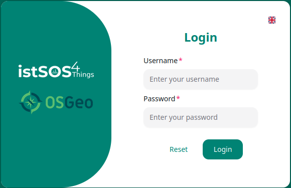

After logging in, the main dashboard is displayed.

  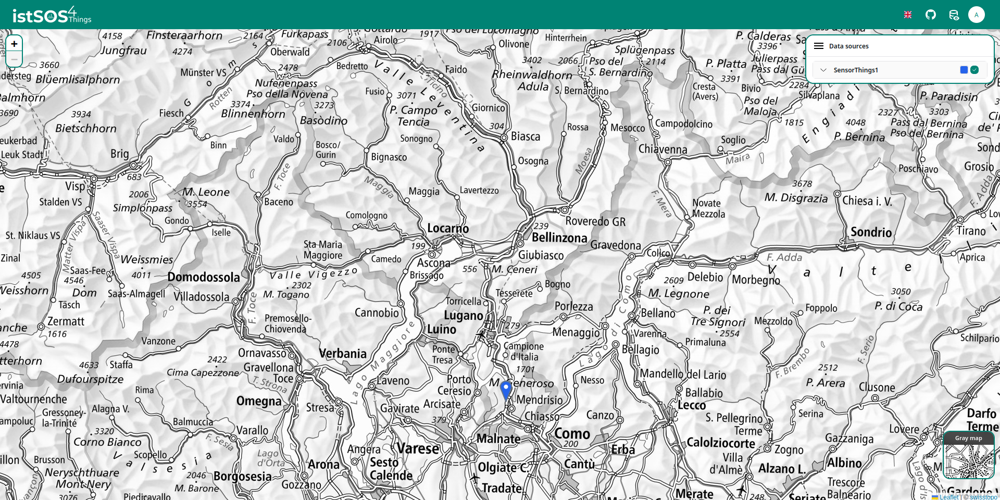

From the dashboard, we can start creating the entities associated with our sensor group.

### :lucide-play: Create the Sensor Entities

To create a new set of entities, start from the map.

Right-click on the map to open the context menu, then select **Add New**.

  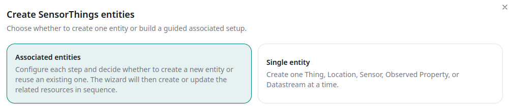

The creation wizard opens. For this tutorial, keep **Associated Entities** selected.

This option allows us to create or select the entities related to the sensor step by step.

### :lucide-play: Create the Thing

The first entity to configure is the **Thing**.

A Thing represents the physical or logical object associated with the observations. In this tutorial, it represents the sensor group that we are going to configure.

Select **New Thing** and complete the fields as follows:

- **Name:** `GROUP_<number>`
- **Description:** `Environmental sensor located in the SUPSI building`

The `<number>` must match the number of the selected `SENSOR_<number>`.

For example, if you are working with `SENSOR_3`, the Thing name should be:

`GROUP_3`

  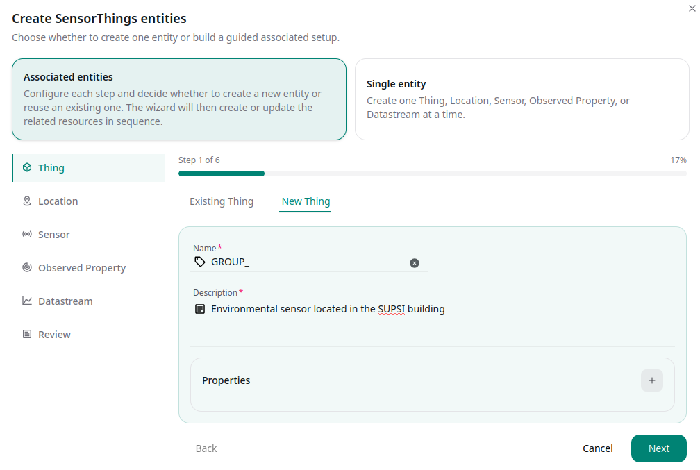

After completing the fields, click **Next**.

### :lucide-play: Select the Location

Next, associate the Thing with a **Location**.

For this tutorial, use the existing Location that represents the room. From the selection list, choose:

`SUPSI`

  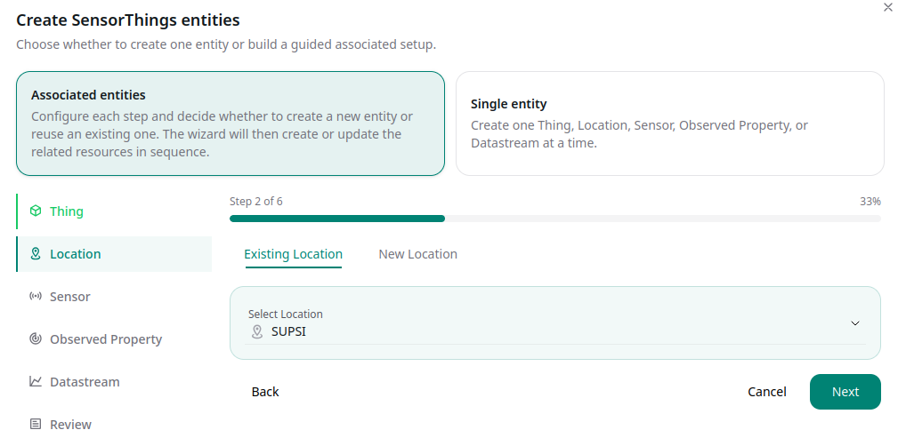

After selecting the Location, click **Next**.

### :lucide-play: Create the Sensor

Now configure the **Sensor**.

The Sensor describes the device or procedure used to produce the observations. In this case, we are creating the sensor associated with the internal temperature measurement.

Select **New Sensor** and complete the fields as follows:

- **Name:** `IT_SENSOR_GROUP_<number>`
- **Encoding Type:** `application/json`
- **Metadata:** `IT`
- **Description:** `Internal temperature channel of GROUP_<number>`

For example, if you are working with `GROUP_3`, the Sensor name should be:

`IT_SENSOR_GROUP_3`

  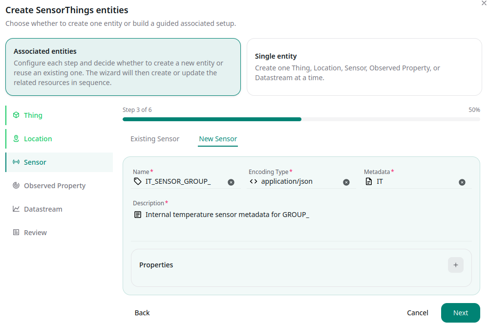

After completing the Sensor information, click **Next**.

### :lucide-play: Select the Observed Property

The **Observed Property** defines what the Sensor measures.

For this tutorial, select the existing Observed Property:

`internal:temperature`

This property is used because the sensor we are configuring measures internal temperature.

  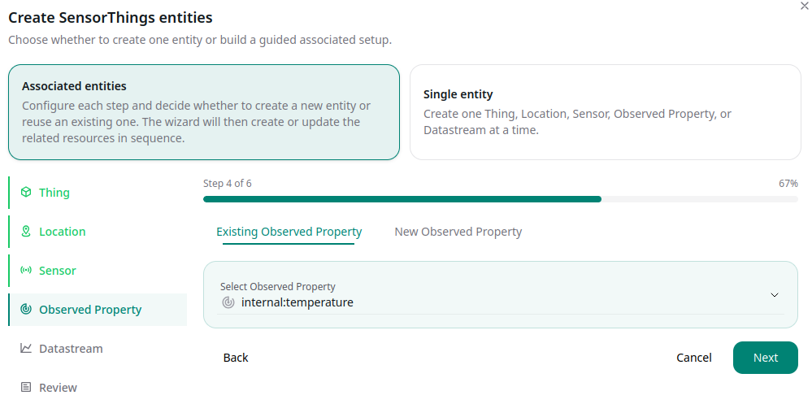

After selecting the Observed Property, click **Next**.

### :lucide-play: Create the Datastream

The next step is to create the **Datastream**.

A Datastream connects the **Thing**, **Sensor**, and **Observed Property**. It describes the stream of observations collected for a specific measured property.

Select **New Datastream** and complete the fields as follows:

- **Name:** `IT_GROUP_<number>`
- **Observation Type:** `http://www.opengis.net/def/observationType/OGC-OM/2.0/OM_Measurement`
- **Description:** `Internal air temperature measured by GROUP_<number>`
- **Unit of Measurement:**
    - **Name:** `name`
    - **Value:** `Degree Celsius`
    - **Name:** `symbol`
    - **Value:** `°C`
- **Properties:**
  - **Name:** `samplingFrequency`
  - **Value:** `PT5M`
- **Network:** `DDT_network`

For example, if you are working with `GROUP_3`, the Datastream name should be:

`IT_GROUP_3`

  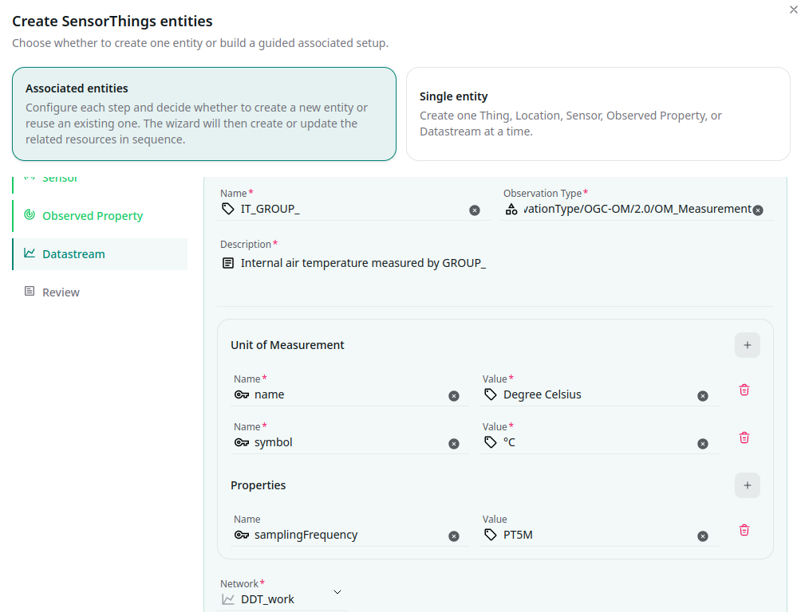

After completing all Datastream fields, click **Next**.

### :lucide-play: Review and Finish

In the **Review** section, check the entities that will be created or associated.

Before completing the process, verify that:

- the Thing uses the correct group number;
- the Location is set to `SUPSI`;
- the Sensor refers to the internal temperature channel;
- the Observed Property is set to `internal:temperature`;
- the Datastream is connected to `DDT_network`.

Then enter a **Commit Message** that clearly describes the operation, for example:

`IT for GROUP_<number>`

  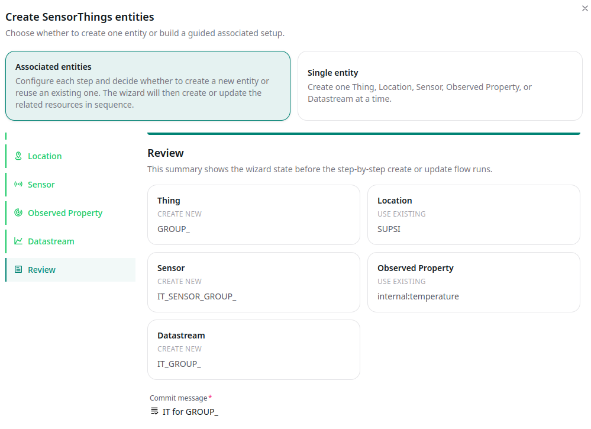

After reviewing the configuration and entering the commit message, click **Finish** to complete the creation process.

### :lucide-play: Create the Remaining Entities with Import from File

Instead of repeating the creation wizard manually for each observed property, you can create the remaining sensors and datastreams using the **Import from file** function of the istSOS4 user interface.

From the map, right-click to open the context menu, then select **Import from file**.

  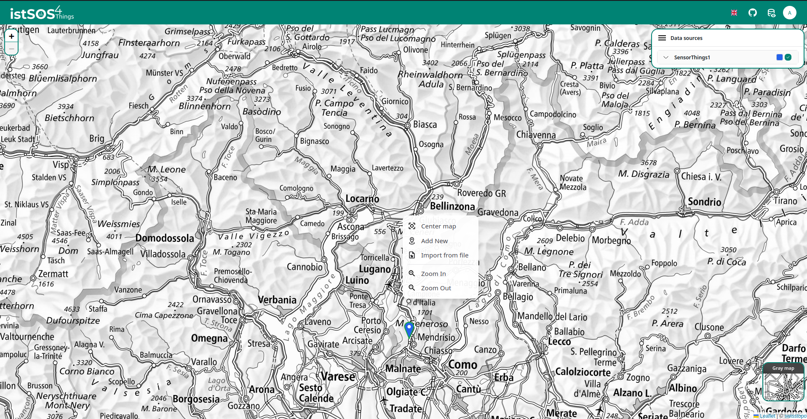

Use the import template file available at the following link:

[Download the import template file](https://geoservice2.ist.supsi.ch/data/GROUP_010.csv)

Before importing the file, edit it and replace the Sensor and Datastream names with the identifiers of your group.

For example, if you are working with `GROUP_010`, make sure that the entities in the file use names consistent with your group identifier, such as:

- `INTERNAL_TEMPERATURE_GROUP_010`
- `INTERNAL_HUMIDITY_GROUP_010`
- `INTERNAL_PRESSURE_GROUP_010`
- `INTERNAL_LUX_GROUP_010`
- `EXTERNAL_WALL_TEMPERATURE_GROUP_010`
- `EXTERNAL_WATER_TEMPERATURE_GROUP_010`
- `SENSOR_BATTERY_GROUP_010`

The same rule applies to the corresponding Sensor names: each Sensor must clearly refer to the same group identifier used by the Datastream.

The import file can be used to create the entities for the remaining observed properties:

- `internal:air:humidity`
- `internal:pressure`
- `internal:lux`
- `external:wall:temperature`
- `external:water:temperature`
- `sensor:battery`

Each imported Datastream must still define the correct `unitOfMeasurement`, because the unit is stored as part of the Datastream configuration.

After selecting the file, the interface processes the import and displays a summary of the operation. The import preview shows which entities have been created and which entities already existed in the system.

  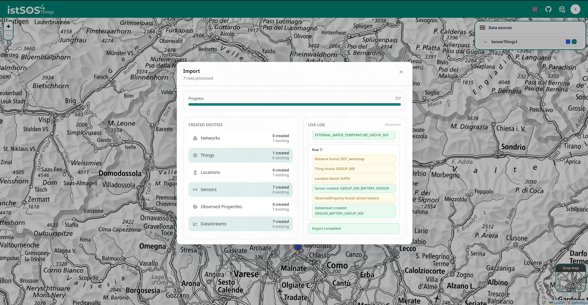

Use the summary to verify that all required entities have been created correctly. In particular, check the counts for **Things**, **Sensors**, **Observed Properties**, and **Datastreams**, and review the live log to confirm that the expected group-specific entities were imported.

After the import is complete, the sensor group is fully described in the system and ready to receive observations.