# Viewing and Analyzing Sensor Data

In this section, we will explore how to view and analyze the data collected by your sensors using the istSOS4 user interface. After configuring your sensors and sending observations to the SensorThings API, you can use the interface to visualize the data, create charts, and gain insights from your sensor measurements.

Open the user interface at: <https://istsos.org/gui> and log in with the `admin/admin` credentials.

### :lucide-play: View Sensor Data

To view the data collected by your sensors, navigate to the **Data sources** panel of the user interface. Here, you can select the specific `Thing`, `Datastream`, or `Observed Property` you want to analyze.

Click on the things icon on the map to open the data sources panel.

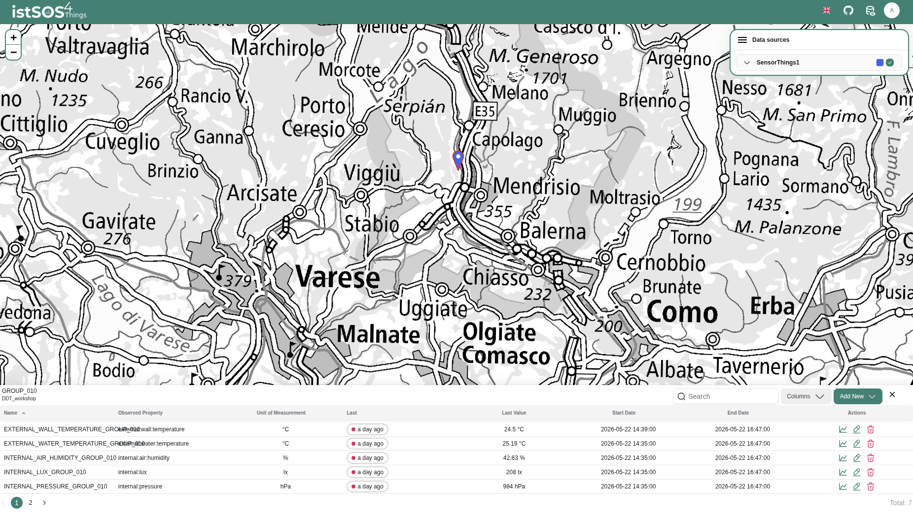

### :lucide-play: View Charts

Once you have selected a specific `Datastream`, you can view the associated observations in a chart format. Click on the chart icon to open the chart view.

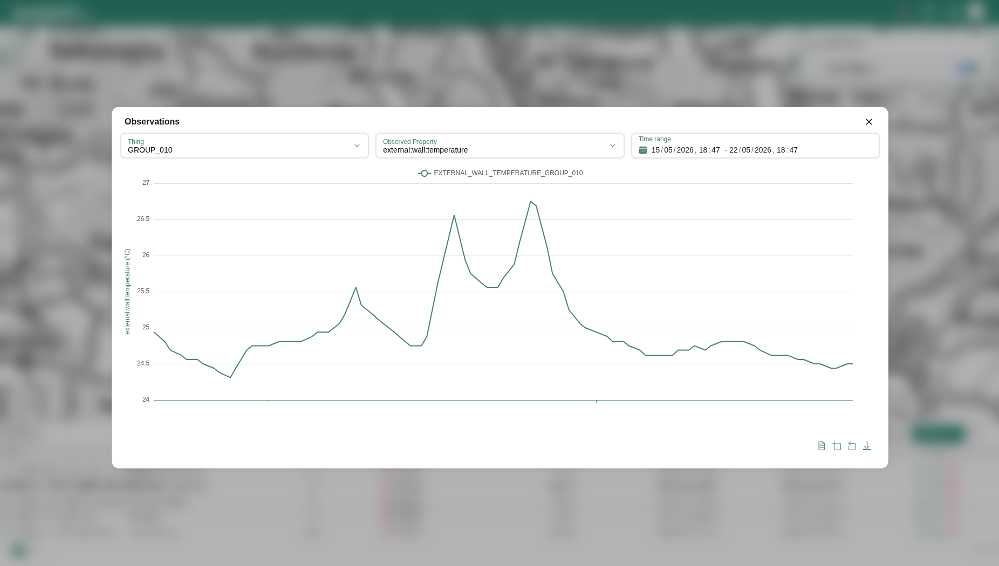

### :lucide-play: Compare series

If you select the **Observed Property** dropdown, you can view the data from all datastreams associated with that `Thing`. Select the observed property you are interested in to compare measurements from different sensors observing the same phenomenon.

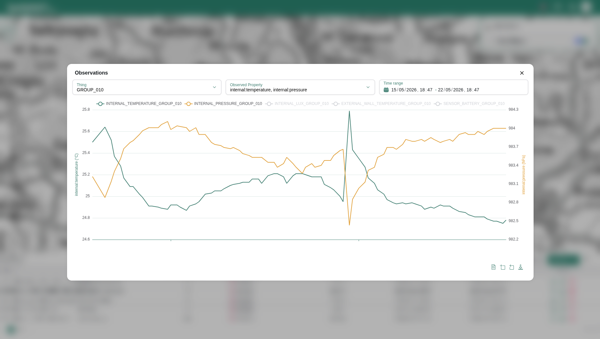

### :lucide-play: Create dashboards via Grafana

You can also visualize istSOS4 observations using Grafana (<https://istsos.org/grafana>). Grafana allows you to create dashboards, configure panels, apply filters, and compare time series from different datastreams.

Open Grafana and log in with the default credentials:

```txt
admin / admin
```

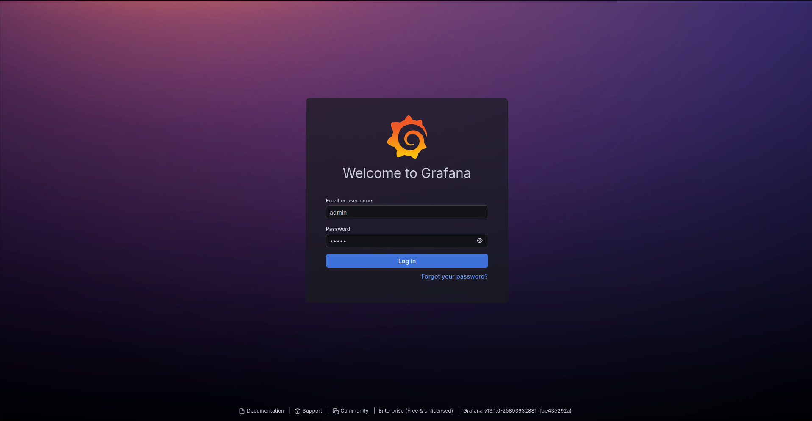

After logging in, open **Connections** from the left navigation menu. This page lets you add a new data source connection or manage existing connections.

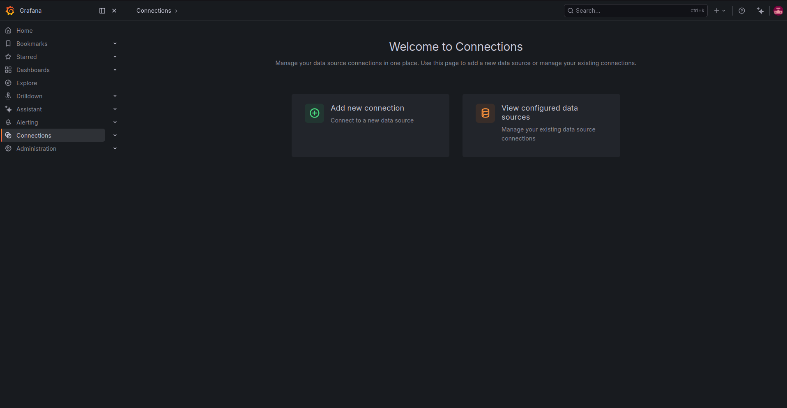

Click **Add new connection**. In the search bar, type `supsi` and select the **istSOS4** data source plugin.

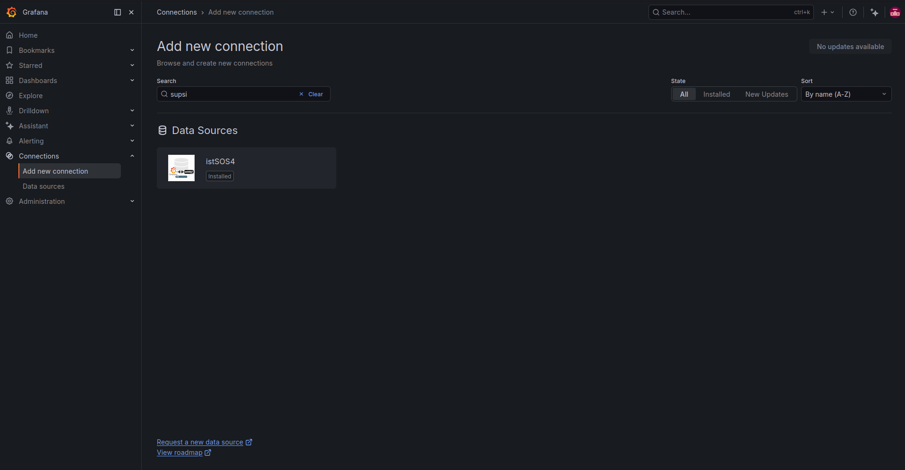

Open the plugin page and click **Add new data source**.

> Depending on your Grafana installation, the plugin may be shown as unsigned. Make sure the plugin comes from a trusted source before using it.

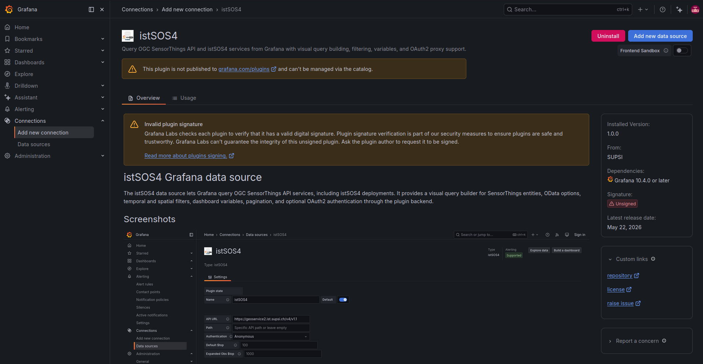

Configure the data source by setting the API endpoint of the SensorThings service.

For example, to connect to the public istSOS4 demo service, use:

```txt
https://istsos.org/v4/v1.1
```

Set the authentication method to **Anonymous**, then click **Save & test**. If the connection is valid, Grafana displays a successful connection message.

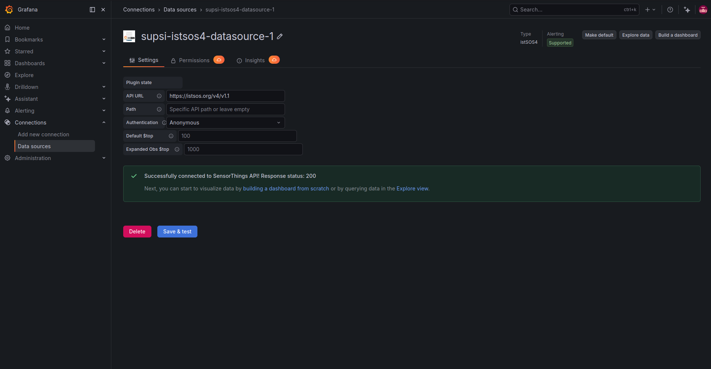

After the data source has been configured, open the **Dashboards** section and click **Create dashboard**.

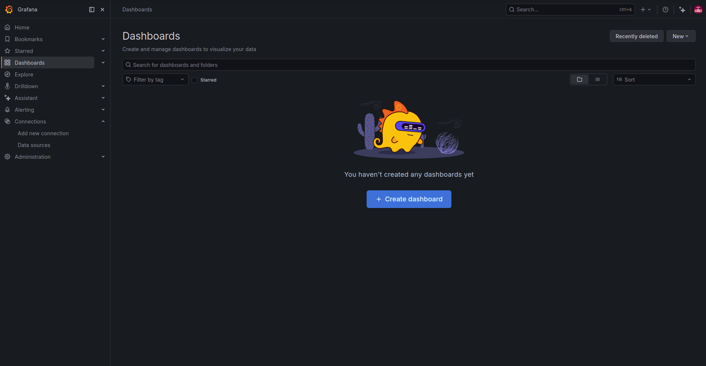

In the new dashboard screen, add a panel. You can use the default custom grid layout.

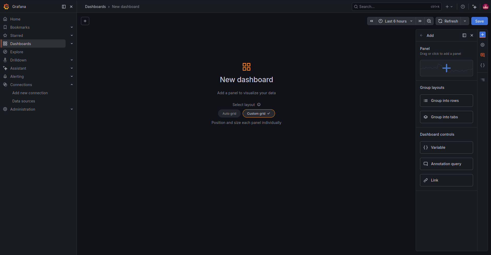

Click **Configure visualization** to open the panel editor.

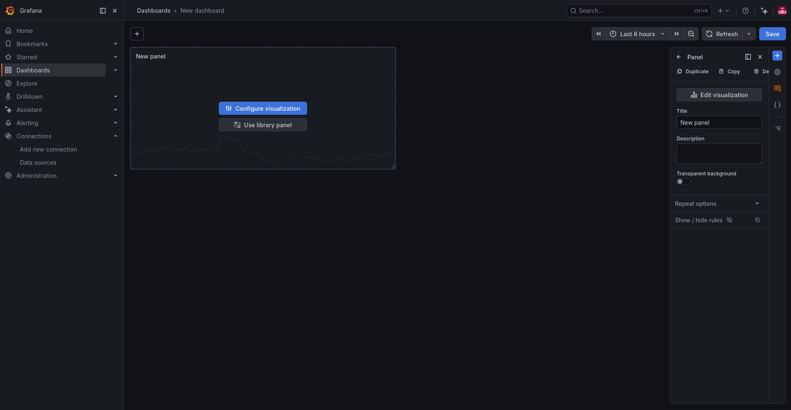

In the panel editor, make sure the configured istSOS4 data source is selected in the query area.

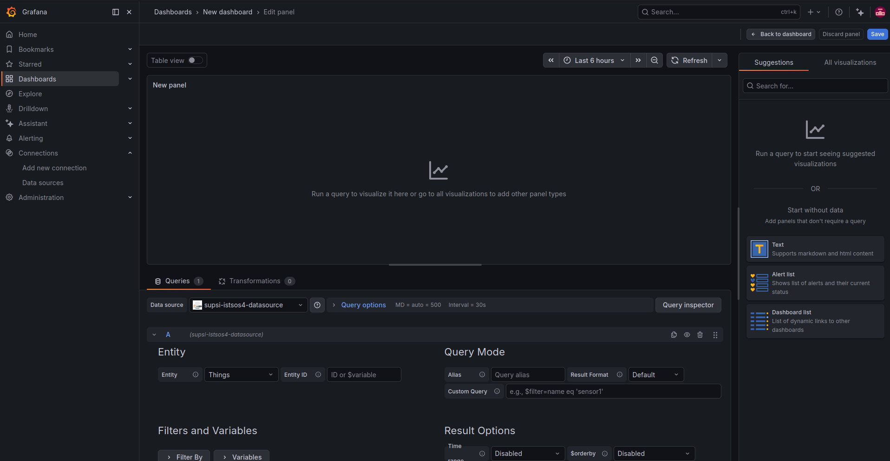

Open **All visualizations** from the right side panel and select **Time series**. This visualization type is suitable for observations collected over time.

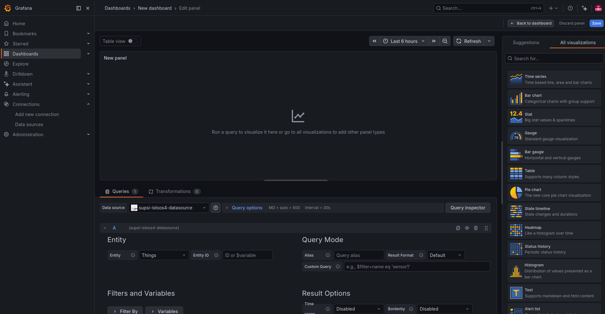

In the query editor, select the entity you want to query. To visualize sensor measurements, select **Observations** as the entity.

Configure the result options as follows:

- **Time range**: `phenomenonTime`
- **$orderby**: `phenomenonTime desc`
- **$select**: leave empty unless you want to restrict the returned fields
- **$top**: optional limit for the number of observations
- **$skip**: optional offset for pagination

Set the panel title to the name of the datastream you want to display. For example:

```txt
INTERNAL_TEMPERATURE_GROUP_010
```

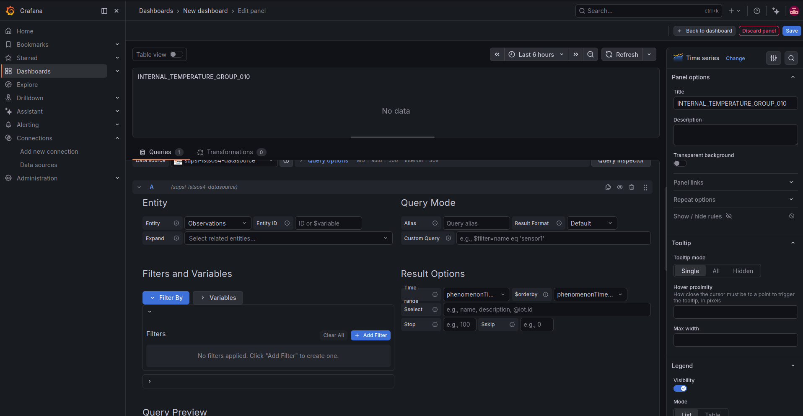

To visualize observations from a specific datastream, add an entity filter with the following settings:

- **Related entity**: `Datastreams`
- **Entity field**: `Name`
- **Operator**: `Equals`
- **Value**: the name of the datastream, for example `INTERNAL_TEMPERATURE_GROUP_010`

The plugin generates a SensorThings API query automatically. For example, the query preview may look like this:

```txt
/Observations?$filter=Datastream/name eq 'INTERNAL_TEMPERATURE_GROUP_010' and phenomenonTime ge '${__from:date:iso}' and phenomenonTime le '${__to:date:iso}'&$orderby=phenomenonTime desc
```

The Grafana time range is automatically applied using the `phenomenonTime` property. You can change the time interval from the time picker in the top-right corner of the dashboard.

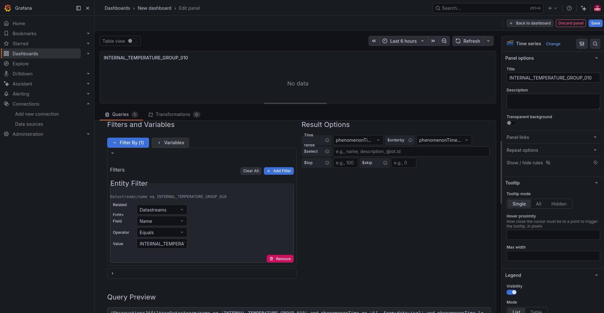

To make the chart easier to read, open the panel options on the right side of the screen. In **Standard options**, set the unit of measurement to **Celsius (°C)**.

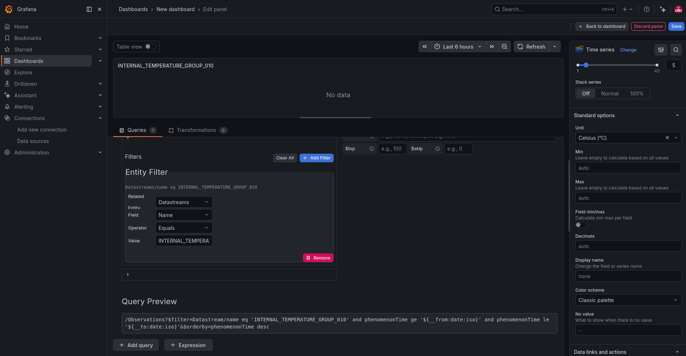

This makes the time series name explicit and displays the temperature values with the correct unit on the chart axis and tooltip.

When the panel is ready, click **Save dashboard**. Enter a dashboard title, for example `GROUP_010`, select the destination folder, and click **Save**.

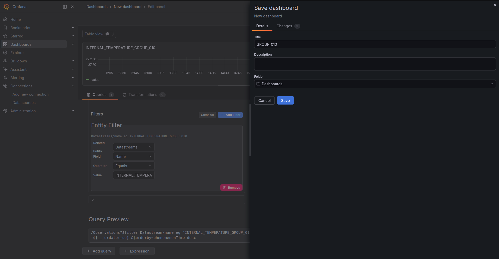

The dashboard now displays the `INTERNAL_TEMPERATURE_GROUP_010` time series with temperature values expressed in degrees Celsius.

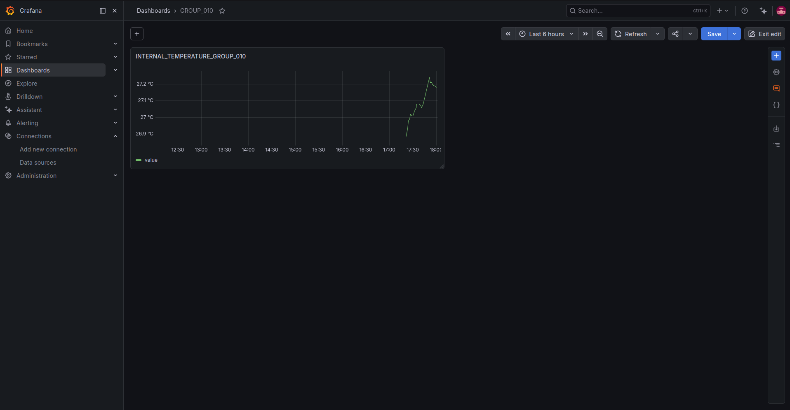

You can repeat the same process to add more panels and compare multiple datastreams in the same dashboard.

### :lucide-play: Configure alerts in Grafana

Grafana can also evaluate istSOS4 observations and send a notification when a sensor value matches an alert condition. This is useful, for example, to notify a group when a temperature, humidity, or light measurement goes above or below a selected threshold.

In this example, we configure a Telegram contact point and create an alert rule for the `INTERNAL_LUX_GROUP_007` datastream.

Open **Alerting** from the left navigation menu, then select **Notification configuration**. In the **Contact points** tab, click **New contact point**.

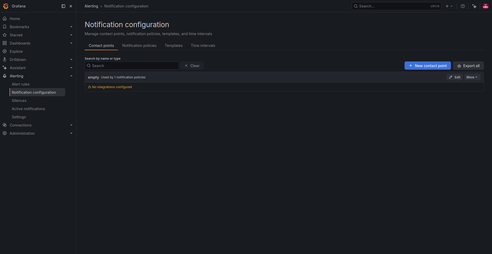

Enter a contact point name that identifies the workshop notification channel, for example:

```txt
ddt_workshop
```

Select **Telegram** as the integration type. Configure the Telegram integration with:

- **BOT API Token**: the token generated for your Telegram bot, for example `5264204876:AAFRpeO4Ni-wVUBpZXIF758Wyj7D7-lRjsA`
- **Chat ID**: the target Telegram chat or channel identifier, for example `@istsos`

> Keep the Telegram bot token private. Do not commit it to a public repository or include it in screenshots shared publicly.

To keep Telegram messages short, expand **Optional Telegram settings** and customize the **Message** field. Click **Edit Message**, choose **Enter custom message**, and use the following custom template:

```txt
{{ range .Alerts.Firing }}
🚨 Low light alert

Datastream: {{ .Labels.alertname }}
Value: {{ .Values.B }} lux
Threshold: {{ index .Annotations "threshold" }} lux

{{ .Annotations.description }}
{{ if .DashboardURL }}
Dashboard: {{ .DashboardURL }}
{{ end }}
{{ end }}
```

This template only prints the firing alert message, the datastream name, the reduced value from expression `B`, the threshold stored in the alert annotations, the description, and the dashboard link when it is available. It omits the default Grafana details such as labels, source links, silence links, and panel links.

Leave **Parse Mode** empty, or keep the default value. In **Notification settings**, enable **Disable resolved message** if you do not want Telegram to receive a notification when the alert returns to normal.

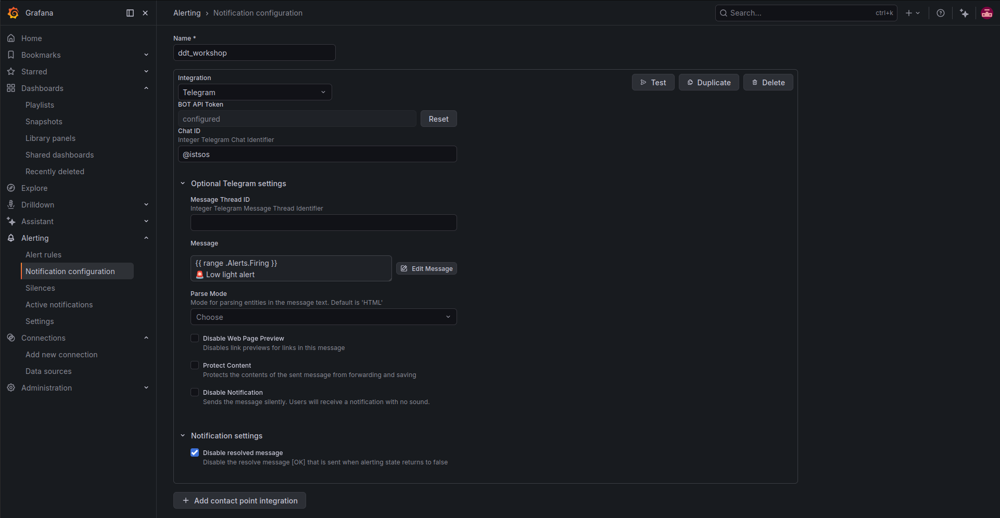

Click **Test** to verify that Grafana can send notifications to Telegram. If the configuration is valid, Grafana displays a successful test message.

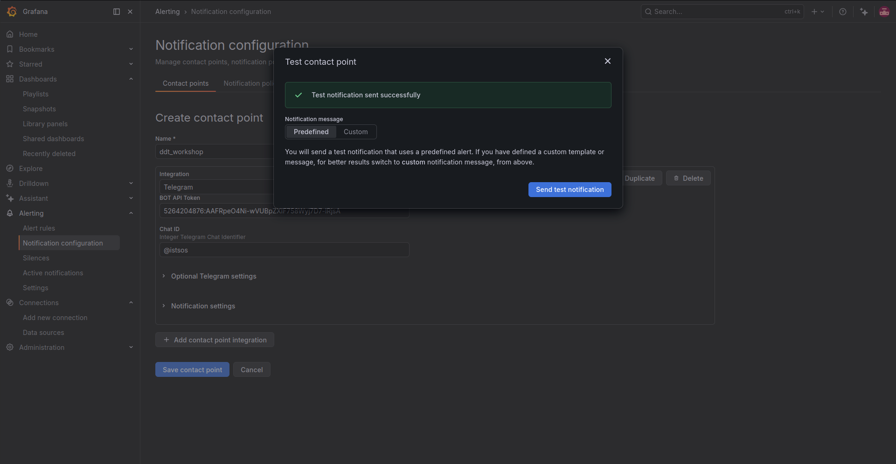

After the test succeeds, close the test dialog and click **Save contact point**.

Next, open the **Notification policies** tab. The default policy defines where alerts are sent when no more specific routing rule matches. Open the **More** menu of the default policy and select **Edit**.

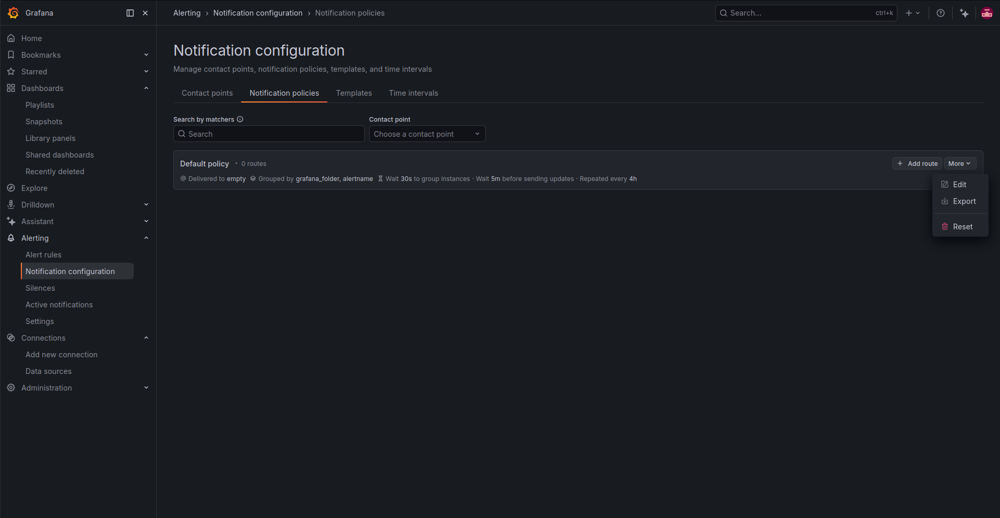

Set the **Default contact point** to the contact point created before:

```txt
ddt_workshop
```

Keep the alerts grouped by:

```txt
grafana_folder
alertname
```

Expand **Timing options** and configure how Grafana groups and repeats notifications. For this workshop, use:

- **Group wait**: `10s`
- **Group interval**: `1m`
- **Repeat interval**: `5h`

With this configuration, Grafana waits 10 seconds before sending the first notification for a new alert group, can send updates for the same group after 1 minute, and repeats an already sent notification only after 5 hours if the alert is still firing.

Then click **Update policy**.

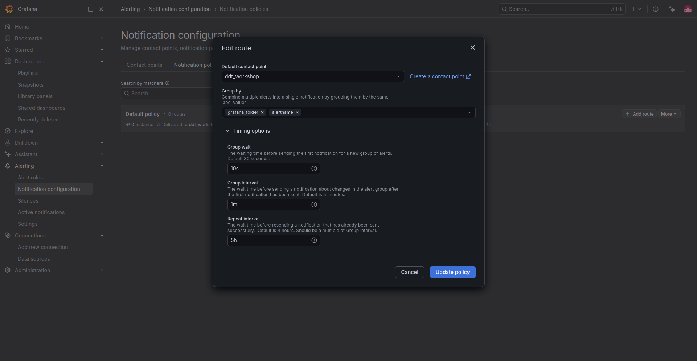

Next, open **Alerting** → **Alert rules**. If no rules have been created yet, Grafana shows an empty alert rules page. Click **New alert rule**.

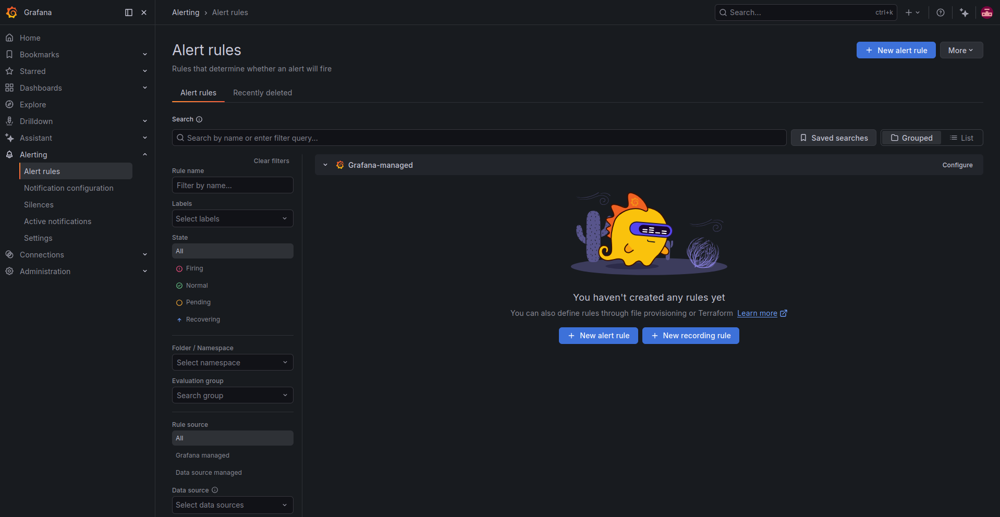

Enter a clear rule name. For example, to create an alert for the light datastream of group 007, use:

```txt
INTERNAL_LUX_GROUP_007
```

In **Define query and alert condition**, select the configured istSOS4 data source, for example:

```txt
supsi-istsos4-datasource
```

Set the query time range to the interval that should be evaluated by the rule, for example:

```txt
10m to now
```

Configure the query to read observations from the target datastream:

- **Entity**: `Observations`
- **Related entity**: `Datastreams`
- **Entity field**: `Name`
- **Operator**: `Equals`
- **Value**: `INTERNAL_LUX_GROUP_007`

Configure the result options as follows:

- **Time range**: `phenomenonTime`
- **$orderby**: `phenomenonTime asc`
- **$select**: leave empty unless you want to restrict the returned fields
- **$top**: optional limit for the returned observations
- **$skip**: optional offset for pagination

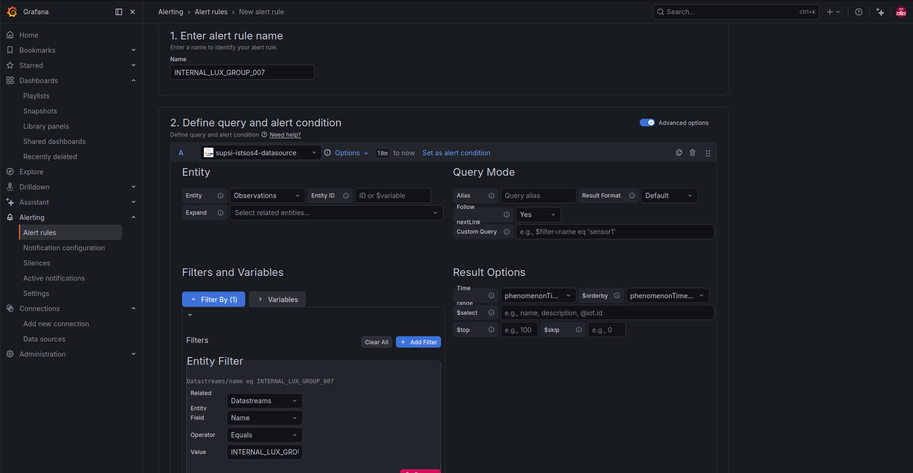

The plugin generates a SensorThings API query automatically. For example, the query preview may look like this:

```txt
/Observations?$filter=Datastream/name eq 'INTERNAL_LUX_GROUP_007' and phenomenonTime ge '${__from:date:iso}' and phenomenonTime le '${__to:date:iso}'&$orderby=phenomenonTime asc
```

Using `phenomenonTime asc` is important in this example because the alert condition uses the **Last** value of the returned series. With ascending ordering, the last point corresponds to the most recent observation.

Define the alert condition using the last value returned by the query. In this example, the alert fires when the latest light measurement is below the selected threshold:

- **Expression B**: `Reduce`
    - **Input**: query `A`
    - **Function**: `Last`
    - **Mode**: `Strict`
- **Expression C**: `Threshold`
    - **Input**: expression `B`
    - **Condition**: `IS BELOW`
    - **Threshold**: `20`

Click **Preview alert rule condition** to verify whether the rule would fire with the current data and time range.

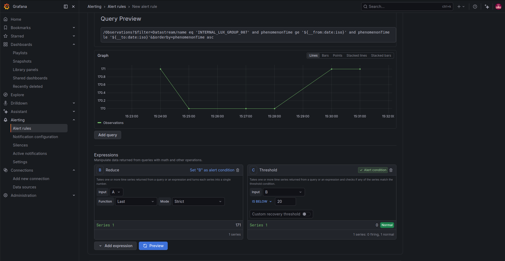

In **Add folder and labels**, select or create a folder to organize the rule. For this workshop example, use:

```txt
DDT_WORKSHOP
```

Labels are optional. They can be useful later to search, silence, group, or route alerts through notification policies.

In **Set evaluation behavior**, create or select an evaluation group. For this example, create a group named:

```txt
DDT
```

Set the **Evaluation interval** to:

```txt
1m
```

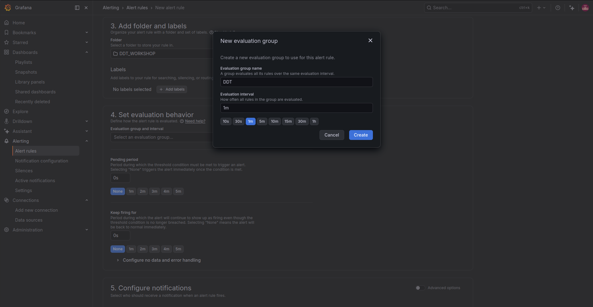

Configure the remaining evaluation settings as follows:

- **Evaluation group and interval**: `DDT`
- **Evaluation interval**: `1m`
- **Pending period**: `0s`
- **Keep firing for**: `0s`

With a pending period of `0s`, Grafana triggers the alert as soon as the condition is met. This is useful during a workshop or demo because alerts react immediately. In production, you may want to use a longer pending period to avoid notifications caused by short-lived spikes or noisy measurements.

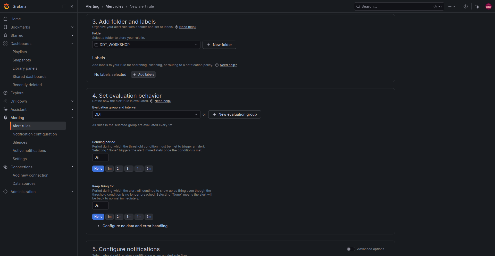

In **Configure notifications**, select the contact point that should receive the alert:

```txt
ddt_workshop
```

Finally, in **Configure notification message**, add a short description. These annotations are used by the custom Telegram message configured in the contact point.

Suggested **Description**:

```txt
The latest lux observation for INTERNAL_LUX_GROUP_007 is below the configured threshold of 20 lux. Check the sensor and the current light conditions.
```

To include the dashboard link in the Telegram notification, click **Link dashboard and panel** and select the dashboard panel associated with this datastream. The custom Telegram template prints the dashboard URL through:

```txt
{{ .DashboardURL }}
```

To avoid hardcoding the threshold in the contact point message, add a custom annotation with the threshold value:

```txt
threshold
20
```

The custom Telegram template reads this annotation through:

```txt
{{ index .Annotations "threshold" }}
```

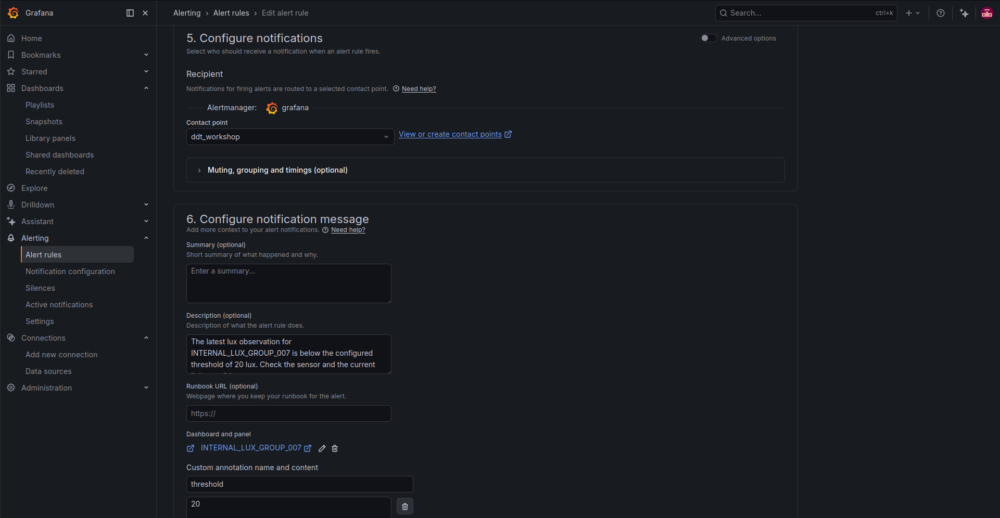

When the rule is ready, click **Save rule and exit**.

Grafana will evaluate the istSOS4 observations every minute and send a compact Telegram notification to `ddt_workshop` when the latest value of `INTERNAL_LUX_GROUP_007` goes below `20`. Resolved notifications are not sent if **Disable resolved message** is enabled in the contact point.

After the alert has fired, return to the linked dashboard to inspect the alert in context. The dashboard panel shows the `INTERNAL_LUX_GROUP_007` time series together with alert state markers, making it easier to see when the rule entered or left the firing state.

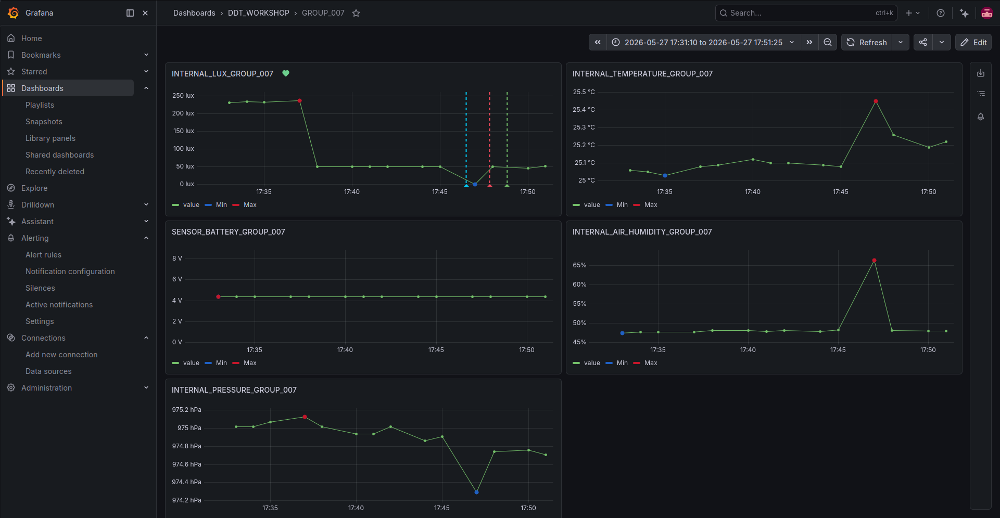

The Telegram notification should now be compact and include only the most relevant alert information: the alert title, datastream name, current value, configured threshold, description, and dashboard link.

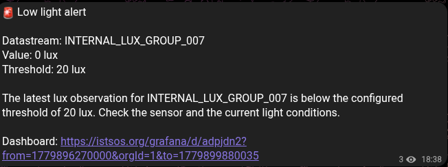