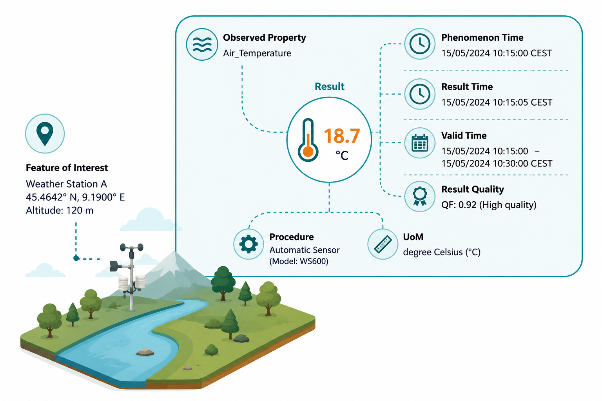

# Observations, Measurements and Samples
**Observations, Measurements and Samples (O&M)** is a key standard developed by the Open Geospatial Consortium (OGC) and ISO approved standard (ISO 19156) for describing observations and sensors in a consistent and interoperable way.

*O&M** provides a standard data model and XML encoding for representing observations, measurements and their associated metadata. It defines a common structure for describing the observed phenomenon, the result of the observation, the time and location of the observation, and other relevant information. O&M is designed to be flexible and extensible, allowing it to be used across different domains and applications.  
Among its adopters there is the USGS, which uses O&M to represent water quality and quantity observations collected by its monitoring networks, the WMO, which uses O&M to represent meteorological observations collected by its member states, and the European Environment Agency (EEA), which uses O&M to represent air quality observations collected by its monitoring stations.

## Properties of an Observation

An observation represents the act of assigning a value to a specific property of a feature-of-interest through a defined observation procedure. The observation produces a **result**, expressed using a given **unit of measurement (uom)**, describing the value associated with the **observedProperty** of the **featureOfInterest**. The observation is temporally characterized by the **phenomenonTime**, indicating when the phenomenon occurred or was measured, the **resultTime**, representing when the result was generated, and the **validTime**, defining the period for which the observation remains valid or applicable. The observation is performed according to a specified **procedure**, which may involve a sensor, instrument, computational workflow, simulation, or human activity. In addition, the observation may include information about the **resultQuality**, providing context on the reliability, accuracy, uncertainty, or fitness-for-use of the produced result. Together, these elements provide the semantic, temporal, spatial, and methodological context necessary to correctly interpret, validate, and reuse observational data.

These properties allow observations to be described in a consistent and interoperable way, enabling them to be shared, integrated and reused across different systems and applications. By adhering to standards like O&M, we can ensure that observations are not only collected, but also documented and shared in ways that allow them to be discovered, accessed and reused by others.

The Observation is therefore modeled as:

- **result:** the value that has been observed or measured
- **phenomenonTime:** the time when the observation was made
- **resultTime:** the time when the result was generated
- **validTime:** the time period for which the result is valid
- **resultQuality:** the quality of the result
- **observedProperty:** the property being observed
- **procedure:** the method or process used to make the observation
- **featureOfInterest:** the (geolocated) feature or entity being observed
- **uom:** the unit of measurement for the result

