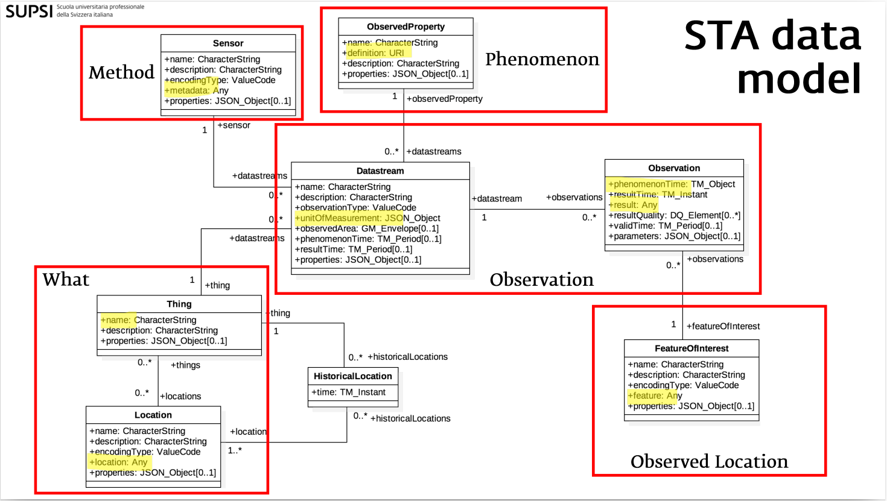
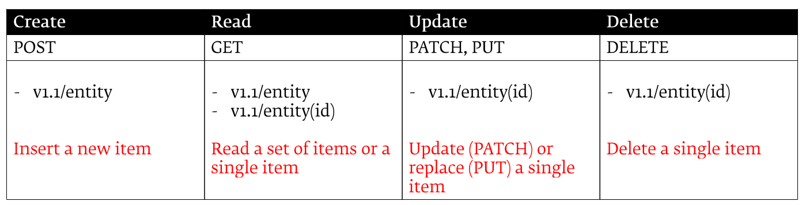
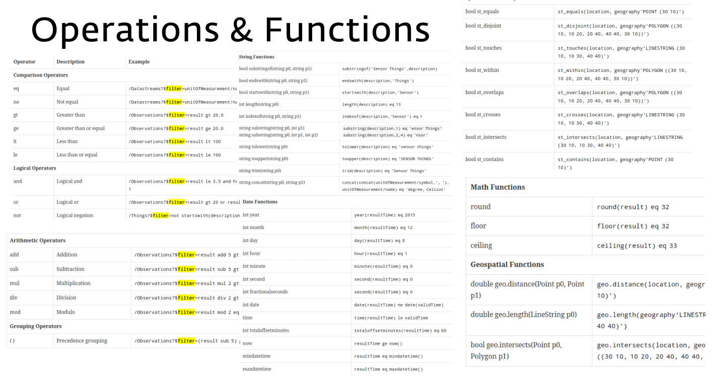

> The OGC SensorThings API is a standard for managing and sharing IoT sensor data.  

## STA Data Model

It defines a set of entities and relationships that allow you to model the real world and the observations made by sensors in a consistent way. 
It not only models the observation but also the sensor and the thing that is observed. 
This allows for a more comprehensive representation of the sensing environment and enables better data understanding, management, and interoperability across different systems and applications.

[SensorThings API (STA)](https://www.ogc.org/standards/sensorthings) is based on the [OGC Observations and Measurements (O&M)](https://www.ogc.org/standards/om) standard, to represent observations and their associated metadata. The **observation** is then related to the **location** where it was performed, the **phenomenon** that has been observed, the **method** that has been used and the **thing** that was observed.

Understanding these key concepts and entitiesis essential for working with the SensorThings API effectively.

| Entity | Description |
|--------|-------------|
| *Thing* | A physical or virtual object in the real world (e.g., a weather station) |
| *Location* | The geographic location of a Thing |
| *Sensor* | An instrument that observes a property (e.g., a thermometer) |
| *ObservedProperty* | The phenomenon being measured (e.g., air temperature) |
| *Datastream* | A collection of observations from a Sensor on a Thing for a specific ObservedProperty |
| *Observation* | A single measurement value at a given time |

## OData

The SensorThings API uses the [OData (Open Data Protocol)](https://www.odata.org/) query language to allow clients to filter, sort, and paginate data when making requests to the API. OData provides a standardized way to query and manipulate data over HTTP, making it easier for developers to work with the SensorThings API and integrate it into their applications.

OData (Open Data Protocol) is a standardized protocol for building and consuming RESTful APIs. Its core principle is uniformity: it enforces a strict set of rules for querying, structuring, and manipulating data, eliminating the varying design patterns typically found in traditional REST APIs

OData offers:

- **Standardized Operations**: It maps standard REST verbs directly to database operations: POST (Create), GET (Read), PUT/PATCH (Update), and DELETE (Delete).
- **Entity Data Model (EDM)**: OData exposes data as a structured graph of Entities (e.g., Customers), their Properties (e.g., Name, Address), and Relationships (e.g., Orders placed by a customer).
- **Self-Descriptive Metadata**: Every OData service exposes a $metadata document. This machine-readable schema defines the exact data types, relationships, and constraints, allowing client applications to build themselves dynamically without prior knowledge of the backend.
- **Rich URI Query Conventions**: Clients can filter, sort, and shape the data they need directly in the URL using reserved words prefixed with $. This prevents over-fetching and reduces server load.

> So, in summary you can use entity in the URL and HTTP Methods to perform CRUDQ (Create, Read, Update, Delete, Query) operations on the SensorThings API elements.

Additionally, you can use OData query parameters to filter, sort, and paginate the data returned by the API. This allows for a flexible and powerful way to interact with the SensorThings API and retrieve the data you need in a way that is efficient and easy to use.

- Sort results by a property **$orderby**: `GET /Things?$orderby=name`
- Filter results by a property **$filter**: `GET /Things?$filter=properties/location eq 'office'`
- Paginate results with **$top**, **$skip** and **$count**: `GET /Things?$top=10&$skip=20&$count=true`
- Select specific properties with **$select**: `GET /Things?$select=name,properties/location`
- Expand related entities with **$expand**: `GET /Things?$expand=Datastreams`

Eventually, you can combine multiple OData query parameters to create complex queries that allow you to retrieve exactly the data you need from the SensorThings API. This makes it a powerful tool for working with IoT sensor data and building applications that can effectively manage and analyze this data.

- select all the Things that are located in the office, order them by name, return only the first 10 results and include the total count of matching Things:  
`GET /Things?$filter=properties/location eq 'office'&$orderby=name&$top=10&$count=true`

Finally, it's important to note that the SensorThings API also supports a set of system query options that allow you to perform operations such as counting the total number of entities in a collection, retrieving the metadata for the API, and more. These system query options are prefixed with a $ and can be used in combination with the OData query parameters to further customize your requests to the SensorThings API.

