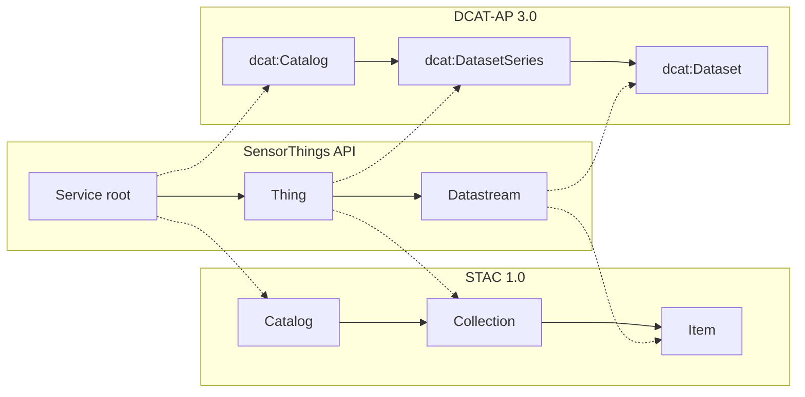
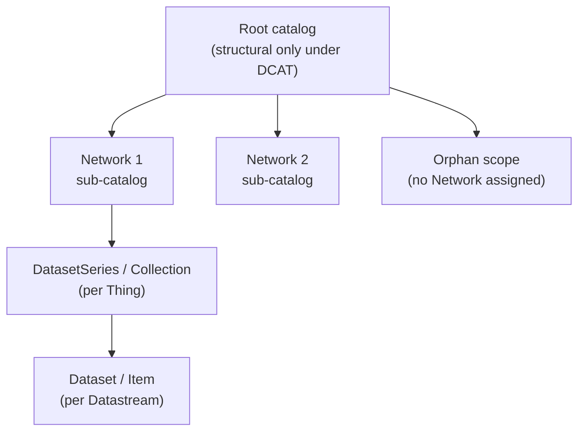

> Built as part of GSoC 2026, under OSGeo/istSOS by Vishmayraj

# STAC and DCAT-AP

In addition to the native [SensorThings API](./sta.md), istSOS4 exposes its sensor metadata as a [STAC](https://stacspec.org/) 1.0 catalog and a [DCAT-AP](https://semiceu.github.io/DCAT-AP/releases/3.0.0/) 3.0 catalog. This lets STAC clients (like STAC Browser) and open data harvesters (like data.europa.eu) discover and browse istSOS4 data without needing to understand SensorThings at all. Both catalogs are generated by the Metadata Connector, which reads sensor metadata straight from Postgres and republishes it on a fixed schedule, so a change in the sensor network shows up in both catalogs together.

## Entity mapping

The pivot in both catalogs is the `Datastream`. It is the only STA entity that carries identity, spatial extent (`observedArea`), temporal extent (`phenomenonTime`), and provenance (`Sensor` and `ObservedProperty`) all at once, so it maps to the atomic dataset unit in each standard. A `Thing` groups its Datastreams above that, one physical device can have several (temperature, humidity, battery, and so on), and that grouping is what `stac:Collection` and `dcat:DatasetSeries` represent.

| STA entity | STAC 1.0 role | DCAT-AP 3.0 role |
|---|---|---|
| STA service root | `Catalog` | `dcat:Catalog` and `dcat:DataService` (dual typed) |
| `Thing` | `Collection` | `dcat:DatasetSeries` |
| `Datastream` | `Item` | `dcat:Dataset` |
| Observations feed | `Asset` (on the Item) | `dcat:Distribution` |
| `Location` | `Item`/`Collection` spatial extent | `dct:spatial`, fallback only |
| `ObservedProperty` | keywords / properties | `dcat:keyword`, `dcat:theme` |



## Catalog scoping: the NETWORK mode

By default (`NETWORK=0`) a deployment publishes one flat catalog: every `Thing` and `Datastream` in one Collection/DatasetSeries tree. If the deployment groups sensors by SensorThings `Network`, setting `NETWORK=1` splits the catalog into one sub catalog per Network, plus an orphan scope for any Datastream with no assigned Network.



A `Datastream` always belongs to exactly one scope, since its `network_id` is single valued, but a `Thing` can appear in more than one scope's tree if its Datastreams are split across Networks. Each appearance only lists the Datastreams that actually belong there, with its own, independently computed spatial and temporal extent.

!!! note "Why the DCAT root stays empty"
    On the STAC side, the root Catalog can safely serve the orphan scope's content directly, since a STAC `Collection`'s `id` and its URL are decoupled. RDF does not have that flexibility: a `dcat:DatasetSeries`'s URI is its identity, so the same Thing cannot carry two different extents in the same graph. That is why, under `NETWORK=1`, the DCAT root graph stays structural (just `dcat:Catalog`, `dcat:DataService`, and links to the other scopes) while the STAC root is more self contained.

## Using it as a user

Every route lives under `/connector`, alongside the rest of the istSOS4 API, and is read only. Nothing here executes a live database query, every response is served straight from a Redis cache that the scheduler refreshes on a fixed interval (5 minutes by default).

### STAC endpoints

| Endpoint | Returns |
|---|---|
| `/connector/stac` | Root Catalog (or, under `NETWORK=1`, the structural root with links to each Network) |
| `/connector/stac/{network_id}` | One Network's sub catalog |
| `/connector/stac/collections` | All Collections in scope |
| `/connector/stac/collections/{collection_id}` | One Collection (`collection_id` = `thing-{id}`) |
| `/connector/stac/collections/{collection_id}/items` | All Items in a Collection |
| `/connector/stac/collections/{collection_id}/items/{item_id}` | One Item (`item_id` = `datastream-{id}`) |

Pointing [STAC Browser](https://radiantearth.github.io/stac-browser/) at `/connector/stac` walks the whole tree with no further configuration.

### DCAT-AP endpoints

Every DCAT-AP route is served in both JSON-LD (default) and Turtle (`.ttl` suffix):

| Endpoint | Returns |
|---|---|
| `/connector/dcat/root` / `/connector/dcat/root.ttl` | Root `dcat:Catalog` |
| `/connector/dcat/orphan` / `/connector/dcat/orphan.ttl` | Orphan scope (`NETWORK=1` only) |
| `/connector/dcat/{network_id}` / `/connector/dcat/{network_id}.ttl` | One Network's sub catalog (`NETWORK=1` only) |

A quick example, fetching a Network's catalog as Turtle:

```bash
curl http://localhost:8018/v4/v1.1/connector/dcat/1.ttl
```

```turtle
@prefix dcat: <http://www.w3.org/ns/dcat#> .
@prefix dct:  <http://purl.org/dc/terms/> .

<.../connector/dcat/1> a dcat:Catalog ;
    dct:title "Network 1" ;
    dcat:dataset <.../connector/dcat/datasets/datastream-14> ,
                 <.../connector/dcat/series/thing-3> .

<.../connector/dcat/series/thing-3> a dcat:DatasetSeries ;
    dct:identifier "thing-3" ;
    dcat:seriesMember <.../connector/dcat/datasets/datastream-14> .
```

The Catalog node lists both the `dcat:DatasetSeries` and every `dcat:Dataset` underneath it directly under `dcat:dataset`. Generic harvesters, such as data.europa.eu's, mostly do not know what a `DatasetSeries` is, so this keeps every individual Dataset discoverable even from a harvester that only ever walks `dcat:dataset` off the Catalog.

## Using it as a deployer

Both transformers are off by default. In your `.env`:

```env
STAC_TRANSFORMER=1
DCAT_TRANSFORMER=1
```

A disabled standard's routes return `404` rather than being unmounted entirely, so the route table stays predictable either way.

DCAT-AP 3.0 requires a handful of identity fields that have no SensorThings equivalent, so they must be set explicitly. If any are missing, the scheduler logs a warning and skips writing a DCAT catalog that cycle, rather than serving one that is missing mandatory fields:

```env
DCAT_CATALOG_TITLE="My istSOS4 Deployment"
DCAT_CATALOG_DESCRIPTION="Environmental sensor network for the Ticino basin"
DCAT_PUBLISHER_NAME="My Organization"
```

A few other settings worth knowing about:

| Variable | Default | Purpose |
|---|---|---|
| `NETWORK` | `0` | Scope by SensorThings `Network` instead of one flat catalog |
| `HARVEST_INTERVAL_MINUTES` | `5` | How often the harvest job refreshes the Redis cache |
| `DCAT_DEFAULT_LICENSE` / `DCAT_DEFAULT_ACCESS_RIGHTS` | *(unset)* | Fallback `dct:license` / `dct:accessRights` for Datastreams that do not set their own |
| `STAC_DEFAULT_LICENSE` | `proprietary` | Fallback `Collection.license`. Must be an SPDX id, `various`, or `proprietary` |

The connector uses the same Redis instance the rest of the stack already runs, no separate service to stand up.

## Access control

Connector routes sit behind the same `AUTHORIZATION` / `ANONYMOUS_VIEWER` model covered in [Authentication and Authorization](./authentication.md), plus two catalog specific flags:

- **`OPEN_CATALOG_METADATA`** (default `1`): in strict auth mode, whether the catalog stays browsable without a token at all. Set it to `0` to require login for every connector route.
- **`CATALOG_CLOSED_NETWORKS`**: a comma separated list of Network ids or names whose existence should be hidden from anonymous callers. An unauthenticated request for a closed Network gets `404`, not `401`, so the network does not even show up as something that exists. It is still fully built and cached, and reachable directly by anyone with a valid token.

Individual STAC Assets and DCAT Distributions (the links back to the actual `Observations`) carry their own `auth:schemes` declaration whenever the underlying STA API requires a login, so a catalog entry can stay openly browsable even when the data it points to does not.

## Further reading

- [Metadata Connector README](https://github.com/Vishmayraj/istSOS4/tree/gsoc/final-cleanup-and-auth/api/app/v1/connector), full configuration reference and package layout
- [STA-STAC Mapping Reference](https://github.com/Vishmayraj/istSOS4/blob/gsoc/final-cleanup-and-auth/api/app/v1/connector/docs/STA-STAC-Transformation-Layer-Reference.md), field by field STAC mapping
- [STA-DCAT-AP Mapping Reference](https://github.com/Vishmayraj/istSOS4/blob/gsoc/final-cleanup-and-auth/api/app/v1/connector/docs/STA-DCAT-AP-Transformation-Layer-Reference.md), field by field DCAT-AP mapping
- [STAC specification](https://stacspec.org/)
- [DCAT-AP 3.0.0](https://semiceu.github.io/DCAT-AP/releases/3.0.0/)