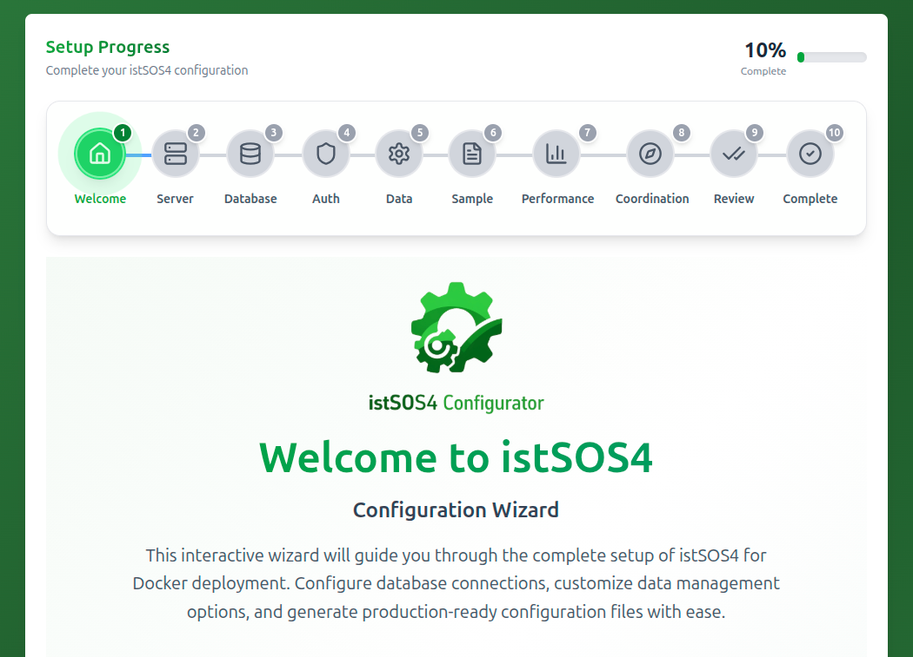

# istSOS4 Configuration
istSOS4 SensorThingsAPI implementation offers a number of configuration options that can be set to customize its behavior. It covers settings for database connection, API behavior, logging, and more.

Docker image configuration is set using the `.env` file in the workshop directory. For more details on running the workshop, see the [Installation](./installation.md) section.

To facilite the configuration of istSOS4, the istSOS Team, during a Google Summer of Code project, developed a [Configurator Wizard](https://istsos.github.io/istSOS4-wizard/) that can be used to generate a valid `.env` and `docker-compose.yml` files based on a graphical interface.The resulting files (.env and docker-compose.yml) can be copied in the workshop directory to override default settings.

