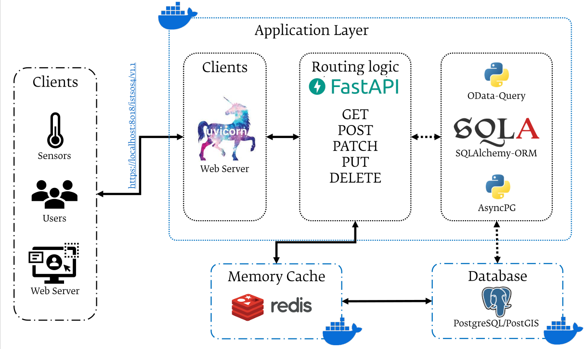

# istSOS4 SensorThingsAPI Workshop

## Introduction

This workshop provides an introduction to the OGC SensorThings API and its implementation in istSOS4, an open-source platform for managing and sharing IoT sensor data in line with the Open Science principles. The workshop is designed to guide participants through the basics of IoT, the SensorThings API, and how to use istSOS4 to manage sensor data effectively. Exercises are provided in Jupyter Notebooks to allow for an interactive learning experience.

## Requirements

The workshop requires [Docker](https://docker.com) and [Docker Compose](https://docs.docker.com/compose/) to be installed on your system. More information on installing Docker can be found [here](./docker.md). A basic understanding of Python programming is recommended but not required, as the workshop includes step-by-step instructions and explanations.

## Technologies of the Workshop

### Internet of Things (IoT)

The **Internet of Things (IoT)** refers to the network of physical devices, sensors, vehicles,
appliances, and other objects embedded with electronics, software, and connectivity that enables
them to collect and exchange data. IoT devices generate vast amounts of real-time measurements —
from environmental monitoring stations tracking temperature, humidity and air quality, to smart
city sensors measuring traffic flows and noise levels.

Managing, storing, and accessing this continuous stream of sensor observations requires a
standardized, interoperable approach. This is where OGC SensorThings API comes in.

### OGC SensorThings API

The **OGC SensorThings API** is an open standard developed by the
[Open Geospatial Consortium (OGC)](https://www.ogc.org/) that provides an open and unified
way to connect IoT sensing devices, data, and applications over the web. It follows a RESTful
approach and uses JSON/GeoJSON for data encoding.

### istSOS4

[**istSOS4**](https://istsos.org) is an open-source implementation of the OGC SensorThings API developed at SUPSI (University of Applied Sciences and Arts of Southern Switzerland). It is built with modern Python web technologies (FastAPI, SQLAlchemy, PostgreSQL/PostGIS).

??? note "istSOS4 Architecture"
   
    

**Repository**: https://github.com/istSOS/istSOS4

### Jupyter Notebooks
The workshop uses <a href="https://jupyter.org" target="_blank" rel="noopener noreferrer"><strong>Jupyter Notebooks</strong></a> to provide an interactive learning experience. Jupyter Notebooks allow you to combine code, visualizations, and narrative text in a single document, making it easier to understand and experiment with the concepts covered in the workshop.

## License

This workshop material is released under the
[Creative Commons Attribution-ShareAlike 4.0 International (CC BY-SA 4.0)](https://creativecommons.org/licenses/by-sa/4.0)
license.

## Support

All bugs, enhancements and issues are managed on
[GitHub](https://github.com/istSOS/istsos4-workshop/issues).
